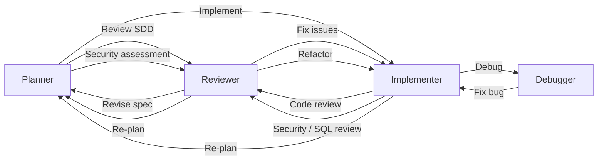
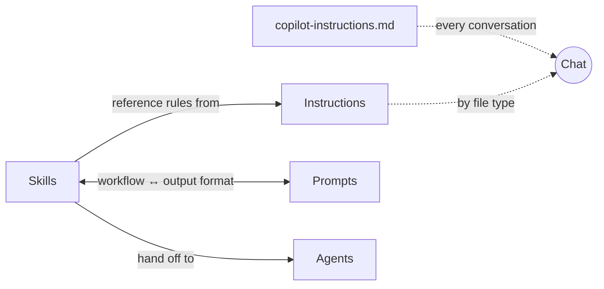
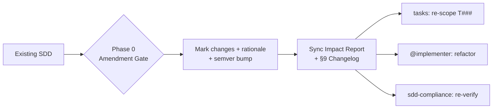

<div align="center">

# Global GitHub Copilot Configuration

**English** | [繁體中文](README.zh-TW.md)

[](LICENSE)
[](https://github.com/zexion7873/copilot-setting/stargazers)
[](https://github.com/zexion7873/copilot-setting/commits)
[](https://github.com/zexion7873/copilot-setting/issues)
[](https://github.com/zexion7873/copilot-setting)


</div>

Personal Copilot settings. Some files are based on [awesome-copilot](https://github.com/github/awesome-copilot), customized as needed.

---

## 📁 Directory Structure

```
~/.github/
├── copilot-instructions.md                ← Global base instructions (custom)
│
├── instructions/                          ← Auto-applied rules based on applyTo pattern
│   ├── context7
│   ├── error-handling
│   ├── global-copilot
│   ├── javadoc
│   ├── jsp
│   ├── junit
│   ├── logging
│   ├── markdown
│   ├── no-heredoc
│   ├── security-and-owasp
│   ├── self-explanatory-code-commenting
│   ├── sql-rules
│   ├── sql-sp-generation
│   ├── xml
│   ├── properties
│   └── yaml-json-config
│
├── agents/                                ← Invoke via @agent-name in chat
│   ├── planner              (Claude Opus 4.6)
│   ├── implementer          (GPT-5.3-Codex)
│   ├── reviewer             (Claude Opus 4.6)
│   └── debugger             (Claude Opus 4.6)
│
├── prompts/                               ← Standards/format references paired with skills
│   ├── adr-template
│   ├── code-review-checklist
│   ├── plan-template
│   ├── spec-template
│   ├── sql-review-output
│   └── tasks-template
│
└── skills/                                ← Executable skills for agents
    ├── adr/
    ├── clarify-task/
    ├── code-review/
    ├── constitution/
    ├── context-discovery/
    ├── debug/
    ├── git-commit/
    ├── implement/
    ├── performance/
    ├── plan/
    ├── refactor/
    ├── sdd/
    ├── sdd-compliance/
    ├── sdd-review/
    ├── security-audit/
    ├── spike/
    ├── sql-review/
    ├── tasks/
    └── test-design/
```

---

## 📜 copilot-instructions.md (Custom)

Minimal global rules loaded in every conversation. Only language and tech stack — all other conventions live in dedicated instruction files.

- Respond in Traditional Chinese (繁體中文)
- All comments, variable names, and class names in code must be in English
- Tech stack: Java 8, Maven, no Spring Boot

> [!NOTE]
> **Why does `global-copilot.instructions.md` contain the same content?**
>
> Copilot loads instructions through two independent scopes:
>
> | Scope | Mechanism | File |
> |-------|-----------|------|
> | **Project** | Copilot auto-loads `.github/copilot-instructions.md` by convention | `copilot-instructions.md` |
> | **User** | VS Code setting points to `~/.github/instructions/` | `global-copilot.instructions.md` |
>
> Project-scope loading does not resolve references to instruction files, so the content must exist in both places. This is a Copilot platform constraint, not accidental duplication.

---

## 📏 Instructions

Automatically injected into the system prompt when the current file matches the `applyTo` glob.

| File | applyTo | Description |
|------|---------|-------------|
| `context7` | `**` | Use Context7 MCP for authoritative external docs and API references |
| `error-handling` | `**/*.java` | Exception handling conventions — hierarchy, custom exceptions, retry, error propagation |
| `global-copilot` | `**` | Global coding standards, conventions, and guidelines |
| `logging` | `**/*.java` | SLF4J + Logback conventions — severity levels, parameterized messages, context, security |
| `javadoc` | `**/*.java` | Javadoc conventions — required tags, summary sentence, formatting, anti-patterns |
| `jsp` | `**/*.jsp` | JSP template conventions — output encoding, JSTL usage, scriptlet avoidance, XSS prevention |
| `junit` | `**/*Test.java, **/*IT.java, **/test/**/*.java` | JUnit 5 + Mockito conventions — naming, AAA, parameterization, assertions |
| `markdown` | `**/*.md` | Markdown formatting aligned to CommonMark spec (0.31.2) |
| `no-heredoc` | `**` | Prevent terminal heredoc file corruption — enforce file editing tools |
| `security-and-owasp` | `**/*.{java,jsp}` | Secure coding based on OWASP Top 10 |
| `self-explanatory-code-commenting` | `**/*.{java,js,ts,py,cs}` | Write self-explanatory code with minimal comments |
| `sql-rules` | `**/*.{java,sql,xml,jsp}` | SQL hard rules: injection prevention, performance, code quality (single source of truth) |
| `sql-sp-generation` | `**/*.sql` | MySQL stored procedure & schema conventions |
| `xml` | `**/*.xml` | XML conventions for Maven POM, web.xml, and configuration files |
| `properties` | `**/*.properties` | Java properties file conventions — key naming, organization, encoding, secret management |
| `yaml-json-config` | `**/*.yml, **/*.yaml, **/*.json` | YAML and JSON configuration file conventions — formatting, structure, secret management |

---

## 🤖 Agents

Invoke via `@agent-name` in Copilot Chat. All agents are tailored for Java 8 / Maven projects.

|   | Agent | Model | Description |
|:-:|-------|-------|-------------|
| 📐 | `@planner` | Claude Opus 4.6 | Activates `plan` / `tasks` / `sdd` / `constitution` / `spike` / `adr` / `clarify-task` skills; plans, specs, and task decomposition in one agent |
| 🔨 | `@implementer` | GPT-5.3-Codex | Activates `implement` / `refactor` / `test-design` / `context-discovery` / `performance` skills, mode-routed by trigger phrase |
| 🔍 | `@reviewer` | Claude Opus 4.6 | Activates `code-review` / `security-audit` / `sql-review` / `sdd-review` / `sdd-compliance` skills, mode-routed by review type |
| 🐛 | `@debugger` | Claude Opus 4.6 | Activates `debug` skill — hypothesis ranking, binary-search isolation, minimal fix with regression test |

### Agent Handoffs Workflow

Agents can hand off tasks to each other, forming a collaborative workflow:



---

## 📋 Prompts

Standards and output-format references, paired with skills. Invoke via `/prompt-name` in Copilot Chat, or let the paired skill cite them automatically.

| Prompt | Paired skill | Purpose |
|--------|-------------|---------|
| `code-review-checklist` | `code-review` | Severity buckets and what to check by category |
| `sql-review-output` | `sql-review` | Output format reference (severity buckets, EXPLAIN cheat sheet) for the sql-review skill |
| `spec-template` | `sdd` | SDD scaffold — 9 sections from background to changelog |
| `plan-template` | `plan` | Implementation plan scaffold with `REQ-` / `CON-` / `PAT-` / `FILE-` identifiers |
| `tasks-template` | `tasks` | Dependency-ordered `tasks.md` scaffold with T### IDs and `[P]` parallel markers |
| `adr-template` | `adr` | ADR scaffold with Status / Context / Decision / Consequences / Alternatives |

> [!NOTE]
> **Naming convention** (suffix indicates content type):
> - `*-template` — fill-in scaffold for one-shot artifact creation (e.g., `spec-template`, `plan-template`)
> - `*-checklist` — verification checklist with categorized items (e.g., `code-review-checklist`)
> - `*-output` — output format / cheat-sheet reference cited by its paired skill (e.g., `sql-review-output`)

---

## ⚡ Skills

Executable workflows. Auto-triggered by Copilot when relevant (unless disabled), or invoke manually via `/skill-name`.

|   | Skill | Trigger | Description |
|:-:|-------|---------|-------------|
| 📜 | `constitution` | Auto + Manual | Project-wide non-negotiable principles and governance — stable, high-level only (200-line hard limit) |
| ❓ | `clarify-task` | Auto + Manual | Interactive task refinement — numbered clarifying questions before acting |
| 🗺️ | `context-discovery` | Auto + Manual | Pre-action context map — files needed, dependencies, tests, reference patterns |
| 📐 | `plan` | Auto + Manual | Implementation plan — phases, requirements, files, risks (hands off atomic tasks to `tasks` skill) |
| 📌 | `adr` | Auto + Manual | Architectural Decision Record — captures a decision with status, alternatives, and consequences |
| 🔬 | `spike` | Auto + Manual | Time-boxed research document for a single technical question |
| 📄 | `sdd` | Auto + Manual | Spec-Driven Development document — formal spec before implementation (supports amendment with semver versioning) |
| 📋 | `sdd-review` | Auto + Manual | SDD specification review BEFORE implementation — completeness, testability, feasibility, clarity audit |
| ☑️ | `tasks` | Auto + Manual | Dependency-ordered atomic task breakdown (T### IDs, [P] markers) after plan or SDD is approved |
| 🔨 | `implement` | Auto + Manual | Feature implementation with SDD compliance, pattern discovery, and self-verification |
| ✅ | `sdd-compliance` | Auto + Manual | Spec compliance matrix AFTER implementation — verifies every AC has tasks, tests, and code evidence |
| ♻️ | `refactor` | Auto + Manual | Surgical refactoring — extract, rename, eliminate smells |
| 🧪 | `test-design` | Auto + Manual | Test case design — boundary identification, category classification, coverage gap audit; hand off to @implementer for coding |
| 📦 | `git-commit` | **Manual only** | Conventional commit message generation and intelligent staging |
| 🔍 | `code-review` | Auto + Manual | Structured code review — correctness, style, bug patterns (use `sdd-compliance` for AC traceability) |
| 🛡️ | `security-audit` | Auto + Manual | OWASP Top 10 audit with severity classification |
| 🗄️ | `sql-review` | Auto + Manual | SQL review — injection prevention, index strategy, anti-patterns |
| 🐛 | `debug` | Auto + Manual | Systematic debugging with hypothesis ranking and isolation |
| ⚡ | `performance` | Auto + Manual | Measure-first performance tuning across frontend, Java backend, and DB |

> [!WARNING]
> `git-commit` is marked **manual only** because it modifies git history. Copilot relies on the description text to suppress auto-invocation; always invoke it explicitly via `/git-commit`.

---

## ⚙️ How It Works

You only touch **agents**. Everything else loads by itself.

| Resource | When it loads | You do |
|----------|---------------|--------|
| **copilot-instructions.md** | Every conversation | Nothing — always there |
| **Instructions** (`instructions/`) | Current file matches `applyTo` glob (e.g., `**/*.java`) | Nothing — injected by file type |
| **Agents** (`agents/`) | You type `@agent-name` in chat | Pick the agent |
| **Skills** (`skills/`) | Copilot matches your message to the skill's `description` | Nothing — fires when relevant |
| **Prompts** (`prompts/`) | Agent/skill reads the file, or you type `/prompt-name` | Rarely — agents handle it |

Resources reference each other to avoid duplication. Skills delegate rules to Instructions, output formats to Prompts, and execution to Agents.



> [!TIP]
> **Maintenance rule:** before renaming or moving any file under `.github/`, run `grep -rn "<old-filename>" .github/` to find inbound references. Broken paths silently degrade Copilot output.

---

## 🔄 Typical Workflow

Example: adding a new API endpoint.

```
You  →  @planner       "I need an API to query order history by customer ID"
                        Planner scans the codebase, drafts a phased plan,
                        then writes a formal SDD (spec) with acceptance criteria
                        ↓ click "開始實作" handoff

You  →  @implementer   Picks up the SDD, writes code following existing patterns
                        ↓ click "Code Review" handoff

You  →  @reviewer      Checks correctness, security, performance
                        Catches SQL injection risk → CRITICAL
                        ↓ click "Fix issues" handoff

You  →  @implementer   Switches to PreparedStatement, writes tests
                        Done ✓
```

Each `↓` is a handoff button in VS Code. The next agent gets the full conversation context.

> [!TIP]
> **Other common starting points:**
> - Bug → `@debugger` → `@implementer`
> - Slow SQL → `@reviewer` (SQL review mode) → `@implementer`
> - Security → `@reviewer` (security audit mode) → `@implementer`
> - Spec review → `@reviewer` (SDD review mode) → `@planner`
> - Research → `@planner` (spike mode) → `@planner` (plan mode)
> - Documentation → `@planner`

### Amendment Workflow

When an existing SDD needs revision mid-implementation (new requirements, API contract changes, schema bumps), the `sdd` skill enters **Phase 0 — Amendment Gate** instead of rewriting from scratch:



Semver convention: **MAJOR** for breaking changes (removed AC, API contract change, incompatible schema), **MINOR** for additive (new AC, new endpoint, backward-compatible schema), **PATCH** for clarifications. Full procedure in `.github/skills/sdd/SKILL.md`.
