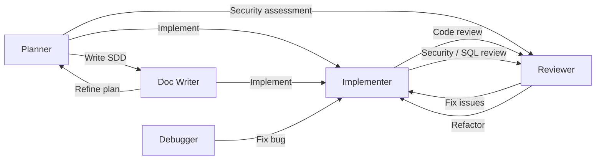
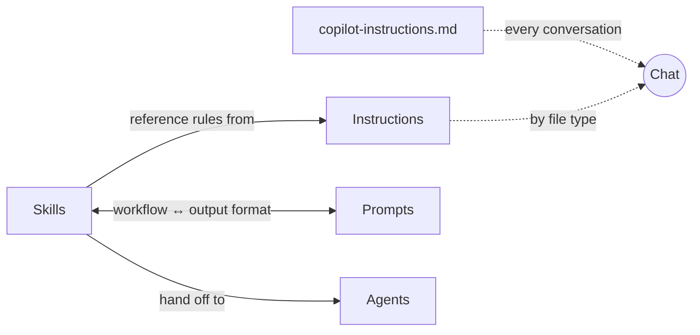

<div align="center">

# Global GitHub Copilot Configuration

**English** | [繁體中文](README.zh-TW.md)

[](LICENSE)
[](https://github.com/zexion7873/copilot-setting/stargazers)
[](https://github.com/zexion7873/copilot-setting/commits)
[](https://github.com/zexion7873/copilot-setting/issues)
[](https://github.com/zexion7873/copilot-setting)


</div>

Personal Copilot settings. Some files are based on [awesome-copilot](https://github.com/github/awesome-copilot), customized as needed.

---

## 📁 Directory Structure

```
~/.github/
├── copilot-instructions.md                ← Global base instructions (custom)
│
├── instructions/                          ← Auto-applied rules based on applyTo pattern
│   ├── context7
│   ├── context-engineering
│   ├── error-handling
│   ├── global-copilot
│   ├── javadoc
│   ├── jsp
│   ├── junit
│   ├── logging
│   ├── markdown
│   ├── no-heredoc
│   ├── oop-design-patterns
│   ├── security-and-owasp
│   ├── self-explanatory-code-commenting
│   ├── sql-rules
│   └── sql-sp-generation
│
├── agents/                                ← Invoke via @agent-name in chat
│   ├── planner              (Claude Opus 4.6)
│   ├── implementer          (GPT-5.3-Codex)
│   ├── reviewer             (Claude Opus 4.6)
│   ├── debugger             (Claude Opus 4.6)
│   └── doc-writer           (Claude Sonnet 4.6)
│
├── prompts/                               ← Standards/format references paired with skills
│   ├── code-review-checklist
│   └── sql-review
│
└── skills/                                ← Executable skills for agents
    ├── adr/
    ├── clarify-task/
    ├── code-review/
    ├── context-discovery/
    ├── debug/
    ├── git-commit/
    ├── implement/
    ├── performance/
    ├── plan/
    ├── refactor/
    ├── sdd/
    ├── security-audit/
    ├── spike/
    ├── sql-review/
    └── test-design/
```

---

## 📜 copilot-instructions.md (Custom)

Minimal global rules loaded in every conversation. Only language and tech stack — all other conventions live in dedicated instruction files.

- Respond in Traditional Chinese (繁體中文)
- All comments, variable names, and class names in code must be in English
- Tech stack: Java 8, Maven, no Spring Boot

> [!NOTE]
> **Why does `global-copilot.instructions.md` contain the same content?**
>
> Copilot loads instructions through two independent scopes:
>
> | Scope | Mechanism | File |
> |-------|-----------|------|
> | **Project** | Copilot auto-loads `.github/copilot-instructions.md` by convention | `copilot-instructions.md` |
> | **User** | VS Code setting points to `~/.github/instructions/` | `global-copilot.instructions.md` |
>
> Project-scope loading does not resolve references to instruction files, so the content must exist in both places. This is a Copilot platform constraint, not accidental duplication.

---

## 📏 Instructions

Automatically injected into the system prompt when the current file matches the `applyTo` glob.

| File | applyTo | Description |
|------|---------|-------------|
| `context7` | `**` | Use Context7 MCP for authoritative external docs and API references |
| `context-engineering` | `**` | Structure code/projects to maximize Copilot effectiveness through better context |
| `error-handling` | `**/*.java` | Exception handling conventions — hierarchy, custom exceptions, retry, error propagation |
| `global-copilot` | `**` | Global coding standards, conventions, and guidelines |
| `logging` | `**/*.java` | SLF4J + Logback conventions — severity levels, parameterized messages, context, security |
| `javadoc` | `**/*.java` | Javadoc conventions — required tags, summary sentence, formatting, anti-patterns |
| `jsp` | `**/*.jsp` | JSP template conventions — output encoding, JSTL usage, scriptlet avoidance, XSS prevention |
| `junit` | `**/*Test.java, **/*IT.java, **/test/**/*.java` | JUnit 5 + Mockito conventions — naming, AAA, parameterization, assertions |
| `markdown` | `**/*.md` | Markdown formatting aligned to CommonMark spec (0.31.2) |
| `no-heredoc` | `**` | Prevent terminal heredoc file corruption — enforce file editing tools |
| `oop-design-patterns` | `**/*.{py,java,ts,js,cs}` | OOP design patterns (GoF + SOLID) |
| `security-and-owasp` | `**/*.{java,jsp}` | Secure coding based on OWASP Top 10 |
| `self-explanatory-code-commenting` | `**/*.{java,js,ts,py,cs}` | Write self-explanatory code with minimal comments |
| `sql-rules` | `**/*.{java,sql,xml,jsp}` | SQL hard rules: injection prevention, performance, code quality (single source of truth) |
| `sql-sp-generation` | `**/*.sql` | MySQL stored procedure & schema conventions |

---

## 🤖 Agents

Invoke via `@agent-name` in Copilot Chat. All agents are tailored for Java 8 / Maven projects.

|   | Agent | Model | Description |
|:-:|-------|-------|-------------|
| 📐 | `@planner` | Claude Opus 4.6 | Analyze requirements, break down tasks, estimate impact scope |
| 🔨 | `@implementer` | GPT-5.3-Codex | Write production code, refactor, and design tests (JUnit 5) |
| 🔍 | `@reviewer` | Claude Opus 4.6 | Code review, security audit (OWASP), and SQL review |
| 🐛 | `@debugger` | Claude Opus 4.6 | Debug by analyzing stack traces and tracing execution |
| 📝 | `@doc-writer` | Claude Sonnet 4.6 | Write SDD (Spec-Driven Development), Javadoc, API docs, migration guides |

### Agent Handoffs Workflow

Agents can hand off tasks to each other, forming a collaborative workflow:



---

## 📋 Prompts

Standards and output-format references, paired with skills. Invoke via `/prompt-name` in Copilot Chat, or let the paired skill cite them automatically.

| Prompt | Paired skill | Purpose |
|--------|-------------|---------|
| `code-review-checklist` | `code-review` | Severity buckets and what to check by category |
| `sql-review` | `sql-review` | Review workflow output format (cross-dialect: MySQL/PostgreSQL/SQL Server/Oracle) |

---

## ⚡ Skills

Executable workflows. Auto-triggered by Copilot when relevant (unless disabled), or invoke manually via `/skill-name`.

|   | Skill | Trigger | Description |
|:-:|-------|---------|-------------|
| ❓ | `clarify-task` | Auto + Manual | Interactive task refinement — numbered clarifying questions before acting |
| 🗺️ | `context-discovery` | Auto + Manual | Pre-action context map — files needed, dependencies, tests, reference patterns |
| 📐 | `plan` | Auto + Manual | Implementation plan with phases, atomic tasks, and acceptance criteria |
| 📌 | `adr` | Auto + Manual | Architectural Decision Record — captures a decision with status, alternatives, and consequences |
| 🔬 | `spike` | Auto + Manual | Time-boxed research document for a single technical question |
| 🔨 | `implement` | Auto + Manual | Feature implementation with SDD compliance, pattern discovery, and self-verification |
| ♻️ | `refactor` | Auto + Manual | Surgical refactoring — extract, rename, eliminate smells |
| 🧪 | `test-design` | Auto + Manual | Test case design — boundary identification, category classification, coverage gap audit; hand off to @implementer for coding |
| 📄 | `sdd` | Auto + Manual | Spec-Driven Development document — formal spec before implementation |
| 📦 | `git-commit` | **Manual only** | Conventional commit message generation and intelligent staging |
| 🔍 | `code-review` | Auto + Manual | Structured code review with issue classification and verdict |
| 🛡️ | `security-audit` | Auto + Manual | OWASP Top 10 audit with severity classification |
| 🗄️ | `sql-review` | Auto + Manual | SQL review — injection prevention, index strategy, anti-patterns |
| 🐛 | `debug` | Auto + Manual | Systematic debugging with hypothesis ranking and isolation |
| ⚡ | `performance` | Auto + Manual | Measure-first performance tuning across frontend, Java backend, and DB |

> [!WARNING]
> `git-commit` is marked **manual only** because it modifies git history. Copilot relies on the description text to suppress auto-invocation; always invoke it explicitly via `/git-commit`.

---

## ⚙️ How It Works

You only touch **agents**. Everything else loads by itself.

| Resource | When it loads | You do |
|----------|---------------|--------|
| **copilot-instructions.md** | Every conversation | Nothing — always there |
| **Instructions** (`instructions/`) | Current file matches `applyTo` glob (e.g., `**/*.java`) | Nothing — injected by file type |
| **Agents** (`agents/`) | You type `@agent-name` in chat | Pick the agent |
| **Skills** (`skills/`) | Copilot matches your message to the skill's `description` | Nothing — fires when relevant |
| **Prompts** (`prompts/`) | Agent/skill reads the file, or you type `/prompt-name` | Rarely — agents handle it |

Resources reference each other to avoid duplication. Skills delegate rules to Instructions, output formats to Prompts, and execution to Agents.



> [!TIP]
> **Maintenance rule:** before renaming or moving any file under `.github/`, run `grep -rn "<old-filename>" .github/` to find inbound references. Broken paths silently degrade Copilot output.

---

## 🔄 Typical Workflow

Example: adding a new API endpoint.

```
You  →  @planner       "I need an API to query order history by customer ID"
                        Planner scans the codebase, breaks it into phased plan
                        ↓ click "寫成 SDD" handoff

You  →  @doc-writer    Turns the plan into a SDD (Spec-Driven Development) document
                        ↓ click "開始實作" handoff

You  →  @implementer   Picks up the SDD, writes code following existing patterns
                        ↓ click "Code Review" handoff

You  →  @reviewer      Checks correctness, security, performance
                        Catches SQL injection risk → CRITICAL
                        ↓ click "Fix issues" handoff

You  →  @implementer   Switches to PreparedStatement, writes tests
                        Done ✓
```

Each `↓` is a handoff button in VS Code. The next agent gets the full conversation context.

> [!TIP]
> **Other common starting points:**
> - Bug → `@debugger` → `@implementer`
> - Slow SQL → `@reviewer` (SQL review mode) → `@implementer`
> - Security → `@reviewer` (security audit mode) → `@implementer`
> - Documentation → `@planner` → `@doc-writer`
