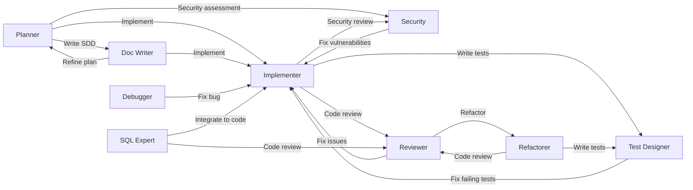

# Global GitHub Copilot Configuration

**English** | [繁體中文](README.zh-TW.md)

[](LICENSE)
[](https://github.com/zexion7873/copilot-setting/stargazers)
[](https://github.com/zexion7873/copilot-setting/commits)
[](https://github.com/zexion7873/copilot-setting/issues)
[](https://github.com/zexion7873/copilot-setting)

Personal Copilot settings. Some files are based on [awesome-copilot](https://github.com/github/awesome-copilot), customized as needed.

## Directory Structure

```
~/.github/
├── copilot-instructions.md                ← Global base instructions (custom)
│
├── instructions/                          ← Auto-applied rules based on applyTo pattern
│   ├── context7
│   ├── context-engineering
│   ├── global-copilot
│   ├── javadoc
│   ├── junit
│   ├── markdown
│   ├── no-heredoc
│   ├── oop-design-patterns
│   ├── security-and-owasp
│   ├── self-explanatory-code-commenting
│   ├── sql-rules
│   └── sql-sp-generation
│
├── agents/                                ← Invoke via @agent-name in chat
│   ├── planner              (Claude Opus 4.6)
│   ├── implementer          (GPT-5.3-Codex)
│   ├── reviewer             (Claude Opus 4.6)
│   ├── test-designer        (Claude Sonnet 4.6)
│   ├── debugger             (Claude Opus 4.6)
│   ├── refactorer           (Claude Sonnet 4.6)
│   ├── sql-expert           (Claude Sonnet 4.6)
│   ├── doc-writer           (GPT-5 mini)
│   └── security             (Claude Opus 4.6)
│
├── prompts/                               ← Standards/format references paired with skills
│   ├── code-review-checklist
│   └── sql-review
│
└── skills/                                ← Executable skills for agents
    ├── adr/
    ├── clarify-task/
    ├── code-review/
    ├── context-discovery/
    ├── debug/
    ├── git-commit/
    ├── implement/
    ├── performance/
    ├── plan/
    ├── refactor/
    ├── security-audit/
    ├── spike/
    ├── sql-review/
    └── test-design/
```

---

## copilot-instructions.md (Custom)

Global base instructions loaded in every conversation.

- Respond in Traditional Chinese (繁體中文)
- All comments, variable names, and class names in code must be in English
- Tech stack: Java 8, Maven, no Spring Boot
- Coding style, error handling, git conventions, logging standards

> **Why does `global-copilot.instructions.md` contain the same content?**
>
> Copilot loads instructions through two independent scopes:
>
> | Scope | Mechanism | File |
> |-------|-----------|------|
> | **Project** | Copilot auto-loads `.github/copilot-instructions.md` by convention | `copilot-instructions.md` |
> | **User** | VS Code setting points to `~/.github/instructions/` | `global-copilot.instructions.md` |
>
> Project-scope loading does not resolve references to instruction files, so the content must exist in both places. This is a Copilot platform constraint, not accidental duplication.

---

## Instructions

Automatically injected into the system prompt when the current file matches the `applyTo` glob.

| File | applyTo | Description |
|------|---------|-------------|
| `context7` | `**` | Use Context7 MCP for authoritative external docs and API references |
| `context-engineering` | `**` | Structure code/projects to maximize Copilot effectiveness through better context |
| `global-copilot` | `**` | Global coding standards, conventions, and guidelines |
| `javadoc` | `**/*.java` | Javadoc conventions — required tags, summary sentence, formatting, anti-patterns |
| `junit` | `**/*Test.java, **/*IT.java, **/test/**/*.java` | JUnit 5 + Mockito conventions — naming, AAA, parameterization, assertions |
| `markdown` | `**/*.md` | Markdown formatting aligned to CommonMark spec (0.31.2) |
| `no-heredoc` | `**` | Prevent terminal heredoc file corruption — enforce file editing tools |
| `oop-design-patterns` | `**/*.{py,java,ts,js,cs}` | OOP design patterns (GoF + SOLID) |
| `security-and-owasp` | `**/*.{java,jsp}` | Secure coding based on OWASP Top 10 |
| `self-explanatory-code-commenting` | `**/*.{java,js,ts,py,cs}` | Write self-explanatory code with minimal comments |
| `sql-rules` | `**/*.{java,sql,xml,jsp}` | SQL hard rules: injection prevention, performance, code quality (single source of truth) |
| `sql-sp-generation` | `**/*.sql` | MySQL stored procedure & schema conventions |

---

## Agents

Invoke via `@agent-name` in Copilot Chat. All agents are tailored for Java 8 / Maven projects.

| Agent | Model | Description |
|-------|-------|-------------|
| `@planner` | Claude Opus 4.6 | Analyze requirements, break down tasks, estimate impact scope |
| `@implementer` | GPT-5.3-Codex | Write production-ready Java code following established patterns |
| `@reviewer` | Claude Opus 4.6 | Code review: correctness, security, performance, maintainability |
| `@test-designer` | Claude Sonnet 4.6 | Design comprehensive test cases (happy path, edge cases, boundary) |
| `@debugger` | Claude Opus 4.6 | Debug by analyzing stack traces and tracing execution |
| `@refactorer` | Claude Sonnet 4.6 | Improve code structure without changing behavior |
| `@sql-expert` | Claude Sonnet 4.6 | SQL writing, optimization, review, and performance analysis |
| `@doc-writer` | GPT-5 mini | Write SDD, Javadoc, API docs, migration guides |
| `@security` | Claude Opus 4.6 | Security review based on OWASP Top 10 for Java web apps |

### Agent Handoffs Workflow

Agents can hand off tasks to each other, forming a collaborative workflow:



---

## How It Works

You only touch **agents**. Everything else loads by itself.

| Resource | When it loads | You do |
|----------|---------------|--------|
| **copilot-instructions.md** | Every conversation | Nothing — always there |
| **Instructions** (`instructions/`) | Current file matches `applyTo` glob (e.g., `**/*.java`) | Nothing — injected by file type |
| **Agents** (`agents/`) | You type `@agent-name` in chat | Pick the agent |
| **Skills** (`skills/`) | Copilot matches your message to the skill's `description` | Nothing — fires when relevant |
| **Prompts** (`prompts/`) | Agent/skill reads the file, or you type `/prompt-name` | Rarely — agents handle it |

## Typical Workflow

Example: adding a new API endpoint.

```
You  →  @planner       "I need an API to query order history by customer ID"
                        Planner scans the codebase, breaks it into phased plan
                        ↓ click "寫成 SDD" handoff

You  →  @doc-writer    Turns the plan into a System Design Document
                        ↓ click "開始實作" handoff

You  →  @implementer   Picks up the SDD, writes code following existing patterns
                        ↓ click "Code Review" handoff

You  →  @reviewer      Checks correctness, security, performance
                        Catches SQL injection risk → CRITICAL
                        ↓ click "修復問題" handoff

You  →  @implementer   Switches to PreparedStatement
                        ↓ click "寫測試" handoff

You  →  @test-designer Designs tests (happy path, null customer, pagination boundary)
                        Done ✓
```

Each `↓` is a handoff button in VS Code. The next agent gets the full conversation context — you stay in the same chat window.

> **Other common starting points:**
> - Bug → `@debugger` → `@implementer`
> - Slow SQL → `@sql-expert` → `@reviewer`
> - Security → `@security` → `@implementer`
> - Documentation → `@planner` → `@doc-writer`

---

## Prompts

Standards and output-format references, paired with skills. Invoke via `/prompt-name` in Copilot Chat, or let the paired skill cite them automatically.

| Prompt | Paired skill | Purpose |
|--------|-------------|---------|
| `code-review-checklist` | `code-review` | Severity buckets and what to check by category |
| `sql-review` | `sql-review` | Review workflow output format (cross-dialect: MySQL/PostgreSQL/SQL Server/Oracle) |

---

## Skills

Executable workflows. Auto-triggered by Copilot when relevant (unless disabled), or invoke manually via `/skill-name`.

| Skill | Trigger | Description |
|-------|---------|-------------|
| `adr` | Auto + Manual | Architectural Decision Record — captures a decision with status, alternatives, and consequences |
| `clarify-task` | Auto + Manual | Interactive task refinement — numbered clarifying questions before acting |
| `code-review` | Auto + Manual | Structured code review with issue classification and verdict |
| `context-discovery` | Auto + Manual | Pre-action context map — files needed, dependencies, tests, reference patterns |
| `debug` | Auto + Manual | Systematic debugging with hypothesis ranking and isolation |
| `git-commit` | **Manual only** | Conventional commit message generation and intelligent staging |
| `implement` | Auto + Manual | Feature implementation with pattern discovery and self-verification |
| `performance` | Auto + Manual | Measure-first performance tuning across frontend, Java backend, and DB |
| `plan` | Auto + Manual | Implementation plan with phases, atomic tasks, and acceptance criteria |
| `refactor` | Auto + Manual | Surgical refactoring — extract, rename, eliminate smells |
| `security-audit` | Auto + Manual | OWASP Top 10 audit with severity classification |
| `spike` | Auto + Manual | Time-boxed research document for a single technical question |
| `sql-review` | Auto + Manual | SQL review — injection prevention, index strategy, anti-patterns |
| `test-design` | Auto + Manual | Test case design with boundary identification and coverage analysis |

> `git-commit` is marked **manual only** in its description because it modifies git history. Copilot relies on the description text to suppress auto-invocation; always invoke it explicitly via `/git-commit`.
