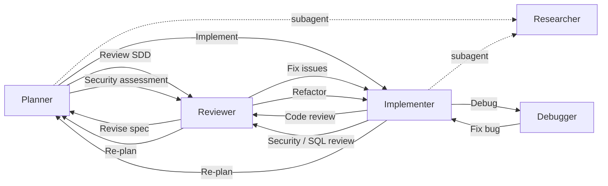

<div align="center">

# GitHub Copilot Configuration

**English** | [繁體中文](README.zh-TW.md)

[](LICENSE)
[](https://github.com/zexion7873/copilot-setting/stargazers)
[](https://github.com/zexion7873/copilot-setting/commits)
[](https://github.com/zexion7873/copilot-setting/issues)
[](https://github.com/zexion7873/copilot-setting)

</div>

A multi-agent Copilot configuration — agents activate workflows, skills define processes, instructions enforce conventions, and prompts standardize output formats.

---

## ⚙️ How It Works

Just pick an **agent** — everything else loads automatically.

| Category | Role | Responsibility | When it loads |
|---|---|---|---|
| **Instructions** (`instructions/`) | Rules | Single source of truth for conventions | Matches `applyTo` glob; skill fallback refs |
| **Agents** (`agents/`) | Router | Activate workflows, manage handoffs | `@agent-name` in chat |
| **Skills** (`skills/`) | Workflow | Execution steps — reference rules and templates | Matches `description`; Skill Activation routes |
| **Prompts** (`prompts/`) | Template | Output format scaffolds | Paired skill refs |
| **Hooks** (`hooks/`) | Lifecycle guard | Block dangerous commands before execution | Agent tool use events |

Resources reference each other to avoid duplication — each category has one job, content that belongs elsewhere is delegated, not copied.

```text
Hooks ──lifecycle guard──→ Agent (Router)
                             │
                             └──activates──→ Skill (Workflow) ──output format──→ Prompt (Template)
                                                  │
                                                  └──rules──→ Instruction (Rules)
```

> [!NOTE]
> **Agent chat caveat:** Instructions only auto-load when a matching file is focused in the editor. In `@agent` chat without a matching file open, file-type rules (e.g., `sql-rules`, `error-handling`) may not be injected. To compensate, code-touching skills (`implement`, `refactor`, `code-review`, `sql-review`, `performance`, `debug`) include inline **fallback rules** for critical conventions — these apply regardless of which file is focused.

> [!TIP]
> **Maintenance rule:** before renaming or moving any file under `.github/`, run `grep -rn "<old-filename>" .github/` to find inbound references. Broken paths silently degrade Copilot output.

---

## 🔄 Typical Workflow

Example: adding a new API endpoint.

```text
You  →  @planner       "I need an API to query order history by customer ID"
                        Planner scans the codebase, drafts a phased plan,
                        then writes a formal SDD (spec) with acceptance criteria
                        ↓ click "開始實作" handoff

You  →  @implementer   Picks up the SDD, writes code following existing patterns
                        ↓ click "Code Review" handoff

You  →  @reviewer      Checks correctness, security, performance
                        Catches SQL injection risk → CRITICAL
                        ↓ click "Fix issues" handoff

You  →  @implementer   Switches to PreparedStatement, verifies fix
                        Done ✓
```

Each `↓` is a handoff button in VS Code. The next agent gets the full conversation context.

> [!TIP]
> **Other common starting points:**
>
> - Bug → `@debugger` → `@implementer`
> - Slow SQL → `@reviewer` (SQL review mode) → `@implementer`
> - Security → `@reviewer` (security audit mode) → `@implementer`
> - Spec review → `@reviewer` (SDD review mode) → `@planner`
> - Documentation → `@planner`

---

## 🤖 Agents

Invoke via `@agent-name` in Copilot Chat. All agents are tailored for Java 8 / Maven projects.

|   | Agent | Model | Description |
|:-:|-------|-------|-------------|
| 📐 | `@planner` | Claude Opus 4.6 | Activates `plan` / `tasks` / `sdd` / `clarify-task` skills; plans, specs, and task decomposition in one agent |
| 🔨 | `@implementer` | GPT-5.3-Codex | Activates `implement` / `refactor` / `test-design` / `performance` skills, mode-routed by trigger phrase |
| 🔍 | `@reviewer` | Claude Opus 4.6 | Activates `code-review` / `security-audit` / `sql-review` / `sdd-review` skills, mode-routed by review type |
| 🐛 | `@debugger` | Claude Opus 4.6 | Activates `debug` skill — hypothesis ranking, binary-search isolation, minimal fix with regression test |
| 📚 | `@researcher` | Claude Haiku 4.5 | Lightweight read-only subagent for `@implementer` and `@planner` — searches codebase and external docs, returns structured summaries |

### 🤝 Agent Handoffs Workflow

Agents can hand off tasks to each other, forming a collaborative workflow:



---

## ⚡ Skills

Executable workflows. Auto-triggered by Copilot when relevant (unless disabled), or invoke manually via `/skill-name`.

|   | Skill | Trigger | Description |
|:-:|-------|---------|-------------|
| ❓ | `clarify-task` | Auto + Manual | Interactive task refinement — numbered clarifying questions before acting |
| 📐 | `plan` | Auto + Manual | Implementation plan — phases, requirements, files, risks (hands off atomic tasks to `tasks` skill) |
| 📄 | `sdd` | Auto + Manual | Spec-Driven Development document — formal spec before implementation |
| 📋 | `sdd-review` | Auto + Manual | SDD specification review BEFORE implementation — completeness, testability, feasibility, clarity audit |
| ☑️ | `tasks` | Auto + Manual | Dependency-ordered atomic task breakdown (T### IDs, [P] markers) after plan or SDD is approved |
| 🔨 | `implement` | Auto + Manual | Feature implementation with SDD compliance, pattern discovery, and self-verification |
| ♻️ | `refactor` | Auto + Manual | Surgical refactoring — extract, rename, eliminate smells |
| 🧪 | `test-design` | Auto + Manual | Test case design — boundary identification, category classification, coverage gap audit |
| 📦 | `git-commit` | **Manual only** | Conventional commit message generation and intelligent staging |
| 🔍 | `code-review` | Auto + Manual | Structured code review — correctness, style, bug patterns |
| 🛡️ | `security-audit` | Auto + Manual | OWASP Top 10 audit with severity classification |
| 🗄️ | `sql-review` | Auto + Manual | SQL review — injection prevention, index strategy, anti-patterns |
| 🐛 | `debug` | Auto + Manual | Systematic debugging with hypothesis ranking and isolation |
| ⚡ | `performance` | Auto + Manual | Measure-first performance tuning across frontend, Java backend, and DB |

> [!WARNING]
> `git-commit` uses `disable-model-invocation: true` to prevent auto-triggering. Always invoke explicitly via `/git-commit`.

---

## 📏 Instructions

Automatically injected into the system prompt when the current file matches the `applyTo` glob.

| File | applyTo | Description |
|------|---------|-------------|
| `error-handling` | `**/*.java` | Exception handling conventions — hierarchy, custom exceptions, and error propagation. |

| `logging` | `**/*.java` | SLF4J + Logback conventions — parameterized messages, severity levels, and security. |
| `jsp` | `**/*.jsp` | JSP template conventions — output encoding, JSTL usage, scriptlet avoidance, and XSS prevention. |
| `markdown` | `**/*.md` | Markdown formatting aligned to CommonMark spec (0.31.2) |
| `no-heredoc` | `**` | Forbid terminal heredoc / redirection for writing file content; use file editing tools instead. |
| `security-and-owasp` | `**/*.java, **/*.jsp` | Secure coding rules based on OWASP Top 10. |
| `self-explanatory-code-commenting` | `**/*.{java,js,ts,py,cs}` | Write self-explanatory code with minimal comments. Only comment WHY when non-obvious. |
| `sql-rules` | `**/*.java, **/*.sql, **/*.xml, **/*.jsp` | SQL hard rules — injection prevention, performance pitfalls, and JDBC resource handling. |
| `sql-sp-generation` | `**/*.sql` | MySQL stored procedure and schema generation conventions. |
| `xml` | `**/*.xml` | XML conventions for Maven POM, web.xml, and configuration files. |
| `properties` | `**/*.properties` | Java properties file conventions — key naming, organization, and secret management. |
| `yaml-json-config` | `**/*.yml, **/*.yaml, **/*.json` | YAML and JSON configuration file conventions — formatting, structure, and secret management. |

---

## 📋 Prompts

Standards and output-format references, paired with skills. Invoke via `/prompt-name` in Copilot Chat, or let the paired skill cite them automatically.

| Prompt | Paired skill | Purpose |
|--------|-------------|---------|
| `code-review-checklist` | `code-review` | Severity buckets and what to check by category |
| `sql-review-output` | `sql-review` | Output format reference (severity buckets, EXPLAIN cheat sheet) for the sql-review skill |
| `spec-template` | `sdd` | SDD scaffold — 8 sections from background to out-of-scope |
| `plan-template` | `plan` | Implementation plan scaffold with `REQ-` / `CON-` / `PAT-` / `FILE-` identifiers |
| `tasks-template` | `tasks` | Dependency-ordered `tasks.md` scaffold with T### IDs and `[P]` parallel markers |


> [!NOTE]
> **Naming convention** (suffix indicates content type):
>
> - `*-template` — fill-in scaffold for one-shot artifact creation (e.g., `spec-template`, `plan-template`)
> - `*-checklist` — verification checklist with categorized items (e.g., `code-review-checklist`)
> - `*-output` — output format / cheat-sheet reference cited by its paired skill (e.g., `sql-review-output`)

---

## 📜 copilot-instructions.md

Minimal global rules loaded in every conversation. Only language and tech stack — all other conventions live in dedicated instruction files.

- Respond in Traditional Chinese (繁體中文)
- All comments, variable names, and class names in code must be in English
- Tech stack: Java 8, Maven, no Spring Boot

---

<details>
<summary><h2>📁 .github/ Directory Structure</h2></summary>

```text
~/.github/
├── copilot-instructions.md                ← Global base instructions
│
├── instructions/                          ← Auto-applied rules based on applyTo pattern
│   ├── error-handling

│   ├── logging
│   ├── jsp
│   ├── markdown
│   ├── no-heredoc
│   ├── security-and-owasp
│   ├── self-explanatory-code-commenting
│   ├── sql-rules
│   ├── sql-sp-generation
│   ├── xml
│   ├── properties
│   └── yaml-json-config
│
├── agents/                                ← Invoke via @agent-name in chat
│   ├── planner              (Claude Opus 4.6)
│   ├── implementer          (GPT-5.3-Codex)
│   ├── reviewer             (Claude Opus 4.6)
│   ├── debugger             (Claude Opus 4.6)
│   └── researcher           (Claude Haiku 4.5)
│
├── hooks/                                 ← Shell commands at agent lifecycle events
│   ├── default.json
│   └── scripts/
│       └── block-dangerous-commands.sh
│
├── prompts/                               ← Standards/format references paired with skills
│   ├── code-review-checklist
│   ├── sql-review-output
│   ├── spec-template
│   ├── plan-template
│   └── tasks-template
│
└── skills/                                ← Executable skills for agents
    ├── clarify-task/
    ├── plan/
    ├── sdd/
    ├── sdd-review/
    ├── tasks/
    ├── implement/
    ├── refactor/
    ├── test-design/
    ├── git-commit/
    ├── code-review/
    ├── security-audit/
    ├── sql-review/
    ├── debug/
    └── performance/
```

</details>
