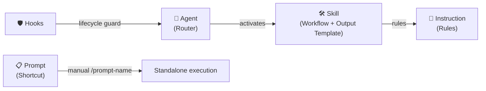
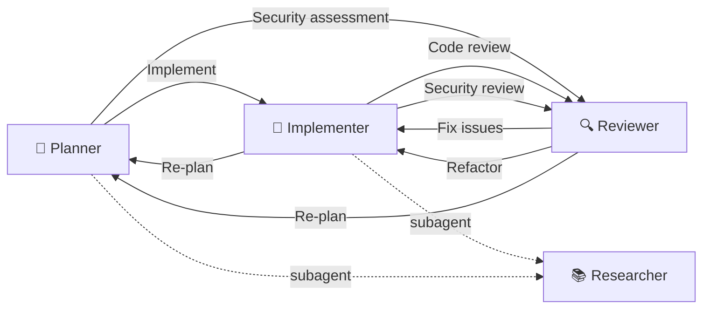

<div align="center">

# Copilot Agentic Context Engineering

**English** | [繁體中文](README.zh-TW.md)

[](LICENSE)
[](https://github.com/zexion7873/copilot-setting/stargazers)
[](https://github.com/zexion7873/copilot-setting/commits)
[](https://github.com/zexion7873/copilot-setting/issues)
[](https://github.com/zexion7873/copilot-setting)

</div>

Agentic context engineering for GitHub Copilot — agents route, skills execute, instructions enforce, hooks guard.

---

## 🚀 Quick Start

### Option A — Single Project

Copy the `.github/` directory into your project root:

```text
your-java-project/
├── .github/          ← paste here
├── src/
├── pom.xml
└── ...
```

Copilot picks it up automatically — agents, skills, instructions, hooks, all active.

### Option B — Workspace-Wide

Add this repository as a folder in a VS Code [multi-root workspace](https://code.visualstudio.com/docs/editor/multi-root-workspaces). Every project in the workspace shares the configuration.

```text
my-workspace.code-workspace
├── copilot-setting/      ← this repo
├── project-a/
├── project-b/
└── ...
```

---

## ⚙️ How It Works

Just pick an **agent** — everything else loads automatically.

|   | Category | Role | Responsibility | When it loads |
|:-:|---|---|---|---|
| 🤖 | **Agents** (`agents/`) | Router | Activate workflows, manage handoffs | Selected from the agents dropdown in chat |
| 🛠️ | **Skills** (`skills/`) | Workflow | Execution steps — reference rules and templates | Matches `description`; Skill Activation routes |
| 📏 | **Instructions** (`instructions/`) | Rules | Single source of truth for conventions | `applyTo` glob matches a file in request context; core rules also embedded in code-touching agents |
| 📋 | **Prompts** (`prompts/`) | Shortcut | Lightweight single-task commands | Manual invocation (`/prompt-name`) |
| 🛡️ | **Hooks** (`hooks/`) | Lifecycle guard | Block dangerous commands before execution | Agent tool use events |

Each category has one job. Content that belongs elsewhere is referenced, not copied.



> [!IMPORTANT]
> **Agent chat caveat:** `applyTo` instructions load only when a matching file is in the request context (attached via `#file:` or the editor), evaluated at request time — files the agent reads mid-task do not retroactively trigger them. To cover `@agent` use without an attached file, the hard-boundary rules are embedded directly in the code-touching agent bodies under `## Coding Standards`; code-touching skills additionally name the instruction files they map to.

> [!TIP]
> **Maintenance rule:** before renaming or moving any file under `.github/`, run `grep -rn "<old-filename>" .github/` to find inbound references. Broken paths silently degrade Copilot output.

---

## 🤖 Agents

Select from the agents dropdown in Copilot Chat. All agents are tailored for Java 8 / Maven projects.

|   | Agent | Model | Description |
|:-:|-------|-------|-------------|
| 📐 | `@planner` | Claude Opus 4.8 | Activates the `plan` skill — clarification, planning, and task decomposition in one agent |
| 🔨 | `@implementer` | GPT-5.3-Codex | Activates `implement` (incl. refactor / test-design / source-check modes) and `debug` skills |
| 🔍 | `@reviewer` | Claude Opus 4.8 | Activates `code-review` / `security-audit` / `sql-review` skills, mode-routed by review type |
| 📚 | `@researcher` | GPT-5.4 mini | Lightweight read-only subagent for `@planner` and `@implementer` — searches codebase and external docs, returns structured summaries — no opinions or recommendations |

### 🤝 Agent Handoffs Workflow

Agents can hand off tasks to each other, forming a collaborative workflow:



---

## 🔄 Typical Workflow

Each `→` is a handoff button in VS Code — click it and the next agent inherits the full conversation context. Every path finishes with `/git-commit` (invoke it manually; it never auto-triggers).

### 📐 `@planner` — Start here for new features

| Skill | What it does | Then hand off to |
|---|---|---|
| `plan` | Clarify vague requirements, create a phased plan, then break the approved plan into atomic, dependency-ordered tasks | → `@implementer` |

> [!TIP]
> Skip `@planner` for small changes (1–3 files) — go straight to `@implementer`.

### 🔨 `@implementer` — Write, change, and debug code

| Skill | What it does | Then hand off to |
|---|---|---|
| `implement` | Implement feature tasks or fix review findings — includes refactor, test-design, and version-matched API source-check modes | → `@reviewer` |
| `debug` | Reproduce → hypothesize → isolate → verify root cause → propose minimal fix | → `implement` |

### 🔍 `@reviewer` — Review and audit

| Skill | When to use | Then hand off to |
|---|---|---|
| `code-review` | General code review — correctness, style, bugs | → `@implementer` (fix) |
| `security-audit` | OWASP Top 10 focused security audit | → `@implementer` (fix) |
| `sql-review` | SQL injection, index strategy, query anti-patterns, migration rollback safety and lock impact | → `@implementer` (fix) |


> [!WARNING]
> Every finding is graded CRITICAL / HIGH / MEDIUM / LOW. Never merge with an open CRITICAL or HIGH.
> If review uncovers a deeper bug → `@implementer` (debug). If design-level rework is needed → `@planner`.

### 📚 `@researcher` — Read-only subagent (automatic)

Usually auto-delegated by `@planner` and `@implementer` to scan the codebase and external docs before acting; can also be selected directly from the agents dropdown. Returns structured summaries — no opinions or recommendations.

---

## 🛠️ Skills

Executable workflows. Auto-triggered by Copilot when relevant (unless disabled), or invoke manually via `/skill-name`.

|   | Skill | Trigger | Description |
|:-:|-------|---------|-------------|
| 🔍 | `code-review` | Auto + Manual | Structured code review — correctness, style, bug patterns |
| 🐛 | `debug` | Auto + Manual | Systematic debugging with hypothesis ranking and isolation |
| 🔨 | `implement` | Auto + Manual | Feature implementation — pattern discovery, convention compliance, self-verification; includes refactor, test-design, and version-matched API source-check modes |
| 📐 | `plan` | Auto + Manual | Implementation plan — clarifies vague requirements first, then phases, acceptance criteria, files, risks; decomposes the approved plan into dependency-ordered tasks (T### IDs) |
| 🛡️ | `security-audit` | Auto + Manual | OWASP Top 10 audit with severity classification |
| 🔎 | `sql-review` | Auto + Manual | SQL review — injection prevention, index strategy, anti-patterns, DDL/DML migration safety |

---

## 📋 Prompts

Lightweight shortcuts. Invoke via `/prompt-name` in Copilot Chat.

| Prompt | Description |
|--------|-------------|
| `/check-n-plus-1` | Check a service method for N+1 query problems |
| `/check-tx` | Verify transaction boundary correctness (self-invocation, rollback-for, read-only) |
| `/find-impact` | List all callers and dependents of the selected method/class |
| `/generate-migration-sql` | Generate MySQL migration + rollback scripts from hbm.xml changes |
| `/git-commit` | Stage related changes and commit with a [Conventional Commits](https://www.conventionalcommits.org/) message |

---

## 📏 Instructions

Automatically injected into the system prompt when the current file matches the `applyTo` glob.

| File | applyTo | Description |
|------|---------|-------------|
| `java` | `**/*.java` | Java 8 language boundary, exception handling, SLF4J logging, and code style — focuses on what AI models get wrong by default. |
| `jsp` | `**/*.jsp` | JSP conventions — XSS prevention via `<c:out>`, JSTL-only policy, output encoding. |
| `no-heredoc` | `**` | Forbid terminal heredoc / redirection for writing file content; use file editing tools instead. |
| `security` | `**/*.java, **/*.jsp` | OWASP Top 10 essentials for Java web applications. |
| `spring-hibernate` | `**/*.java, **/*.hbm.xml` | Spring Core 3.2 + Hibernate 4.2 — native Session API, hbm.xml mappings, `getCurrentSession()` lifecycle, XML `<tx:advice>` transactions. The most critical file. |
| `sql` | `**/*.java, **/*.sql, **/*.xml` | SQL injection prevention, performance pitfalls, JDBC resource handling, and MySQL stored procedure conventions. |
| `testing` | `**/*Test.java, **/*Tests.java, **/*IT.java` | Test conventions — JUnit 4 + Mockito + Spring Test 3.2, no JUnit 5, no Spring Boot Test. |
| `xml-config` | `**/*.xml` | Spring XML config, Hibernate hbm.xml, and Maven POM conventions. |

---

## 📜 copilot-instructions.md

Minimal global rules loaded in every conversation. Language, tech stack, and coding philosophy — all other conventions live in dedicated instruction files.

- Respond in Traditional Chinese (繁體中文)
- Tech stack: Java 8, Maven, Spring 3.2, Spring Security 3.2, Hibernate 4.2, MySQL 8.0, SLF4J 1.7 + Logback, JSP + JSTL 1.2
- Coding philosophy: think before coding (surface assumptions, don't guess), simplicity first (no speculative abstractions), surgical changes (touch only what the task requires)

---

<details>
<summary><h2>📁 What Copilot Loads</h2></summary>

```text
.github/
├── agents/                                ← Selected from the agents dropdown in chat
│   ├── implementer.agent.md          (GPT-5.3-Codex)
│   ├── planner.agent.md              (Claude Opus 4.8)
│   ├── researcher.agent.md           (GPT-5.4 mini)
│   └── reviewer.agent.md             (Claude Opus 4.8)
│
├── hooks/                                 ← Shell commands at agent lifecycle events
│   ├── scripts/
│   │   └── block-dangerous-commands.sh
│   └── default.json
│
├── instructions/                          ← Auto-applied rules based on applyTo pattern
│   ├── java.instructions.md
│   ├── jsp.instructions.md
│   ├── no-heredoc.instructions.md
│   ├── security.instructions.md
│   ├── spring-hibernate.instructions.md
│   ├── sql.instructions.md
│   ├── testing.instructions.md
│   └── xml-config.instructions.md
│
├── prompts/                               ← Lightweight single-task shortcuts (/prompt-name)
│   ├── check-n-plus-1.prompt.md
│   ├── check-tx.prompt.md
│   ├── find-impact.prompt.md
│   ├── generate-migration-sql.prompt.md
│   └── git-commit.prompt.md
│
├── skills/                                ← Executable skills for agents (output templates embedded)
│   ├── code-review/
│   ├── debug/
│   ├── implement/
│   ├── plan/
│   ├── security-audit/
│   └── sql-review/
│
└── copilot-instructions.md                ← Global base instructions
```

</details>
