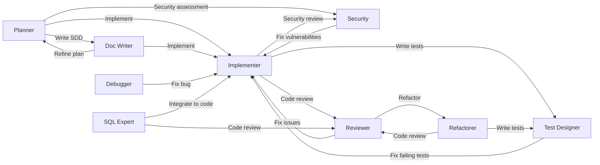

# Global GitHub Copilot Configuration

**English** | [繁體中文](README.zh-TW.md)

[](LICENSE)
[](https://github.com/zexion7873/copilot-setting/stargazers)
[](https://github.com/zexion7873/copilot-setting/commits)
[](https://github.com/zexion7873/copilot-setting/issues)
[](https://github.com/zexion7873/copilot-setting)

Personal Copilot settings. All files except `copilot-instructions.md` are based on [awesome-copilot](https://github.com/github/awesome-copilot), customized as needed.

## Directory Structure

```
~/.github/
├── copilot-instructions.md                ← Global base instructions (custom)
│
├── instructions/                          ← Auto-applied rules based on applyTo pattern
│   ├── context7
│   ├── context-engineering
│   ├── global-copilot
│   ├── markdown
│   ├── no-heredoc
│   ├── oop-design-patterns
│   ├── security-and-owasp
│   ├── self-explanatory-code-commenting
│   └── sql-sp-generation
│
├── agents/                                ← Invoke via @agent-name in chat
│   ├── planner              (Claude Opus 4.6)
│   ├── implementer          (GPT-5.3-Codex)
│   ├── reviewer             (Claude Opus 4.6)
│   ├── test-designer        (Claude Sonnet 4.6)
│   ├── debugger             (Claude Opus 4.6)
│   ├── refactorer           (Claude Sonnet 4.6)
│   ├── sql-expert           (Claude Sonnet 4.6)
│   ├── doc-writer           (GPT-5 mini)
│   └── security             (Claude Opus 4.6)
│
├── prompts/                               ← Reusable prompt templates
│   ├── code-review-checklist
│   ├── context-map
│   ├── conventional-commit
│   ├── create-architectural-decision-record
│   ├── create-implementation-plan
│   ├── create-technical-spike
│   ├── first-ask
│   ├── java-docs
│   ├── java-junit
│   ├── java-refactoring-extract-method
│   ├── java-refactoring-remove-parameter
│   ├── performance-optimization
│   ├── refactor-plan
│   ├── review-and-refactor
│   ├── sql-code-review
│   ├── sql-optimization
│   └── what-context-needed
│
└── skills/                                ← Executable skills for agents
    ├── code-review/
    ├── debug/
    ├── git-commit/
    ├── implement/
    ├── refactor/
    ├── security-audit/
    ├── sql-review/
    └── test-design/
```

---

## copilot-instructions.md (Custom)

Global base instructions loaded in every conversation.

- Respond in Traditional Chinese (繁體中文)
- All comments, variable names, and class names in code must be in English
- Tech stack: Java 8, Maven, no Spring Boot
- Coding style, error handling, git conventions, logging standards

---

## Instructions

Automatically injected into the system prompt when the current file matches the `applyTo` glob.

| File | applyTo | Description |
|------|---------|-------------|
| `context7` | `**` | Use Context7 MCP for authoritative external docs and API references |
| `context-engineering` | `**` | Structure code/projects to maximize Copilot effectiveness through better context |
| `global-copilot` | `**` | Global coding standards, conventions, and guidelines |
| `markdown` | `**/*.md` | Markdown formatting aligned to CommonMark spec (0.31.2) |
| `no-heredoc` | `**` | Prevent terminal heredoc file corruption — enforce file editing tools |
| `oop-design-patterns` | `**/*.{py,java,ts,js,cs}` | OOP design patterns (GoF + SOLID) |
| `security-and-owasp` | `**/*.java` | Secure coding based on OWASP Top 10 |
| `self-explanatory-code-commenting` | `**/*.{java,js,ts,py,cs}` | Write self-explanatory code with minimal comments |
| `sql-sp-generation` | `**/*.sql` | Guidelines for MySQL SQL and stored procedures |

---

## Agents

Invoke via `@agent-name` in Copilot Chat. All agents are tailored for Java 8 / Maven projects.

| Agent | Model | Description |
|-------|-------|-------------|
| `@planner` | Claude Opus 4.6 | Analyze requirements, break down tasks, estimate impact scope |
| `@implementer` | GPT-5.3-Codex | Write production-ready Java code following established patterns |
| `@reviewer` | Claude Opus 4.6 | Code review: correctness, security, performance, maintainability |
| `@test-designer` | Claude Sonnet 4.6 | Design comprehensive test cases (happy path, edge cases, boundary) |
| `@debugger` | Claude Opus 4.6 | Debug by analyzing stack traces and tracing execution |
| `@refactorer` | Claude Sonnet 4.6 | Improve code structure without changing behavior |
| `@sql-expert` | Claude Sonnet 4.6 | SQL writing, optimization, review, and performance analysis |
| `@doc-writer` | GPT-5 mini | Write SDD, Javadoc, API docs, migration guides |
| `@security` | Claude Opus 4.6 | Security review based on OWASP Top 10 for Java web apps |

### Agent Handoffs Workflow

Agents can hand off tasks to each other, forming a collaborative workflow:



---

## Prompts

Reusable prompt templates. Invoke via `/prompt-name` in Copilot Chat.

| Prompt | Description |
|--------|-------------|
| `context-map` | Generate a map of all relevant files before making changes |
| `first-ask` | Interactive task refinement — clarify scope before acting |
| `what-context-needed` | Ask Copilot what files it needs before answering |
| `create-implementation-plan` | Structured implementation plan for features or refactoring |
| `create-technical-spike` | Time-boxed technical spike document |
| `create-architectural-decision-record` | ADR document for decision documentation |
| `java-docs` | Generate Javadoc comments |
| `java-junit` | JUnit 5 unit testing with data-driven tests |
| `java-refactoring-extract-method` | Extract Method refactoring |
| `java-refactoring-remove-parameter` | Remove Parameter refactoring |
| `sql-code-review` | SQL code review (MySQL/PostgreSQL/SQL Server/Oracle) |
| `sql-optimization` | SQL performance optimization and execution plan analysis |
| `review-and-refactor` | Review and refactor code per defined instructions |
| `refactor-plan` | Plan multi-file refactors with sequencing and rollback |
| `conventional-commit` | Generate conventional commit messages |
| `performance-optimization` | Frontend, backend, and database performance optimization |
| `code-review-checklist` | Generic code review checklist |

---

## Skills

Executable workflows. Auto-triggered by Copilot when relevant (unless disabled), or invoke manually via `/skill-name`.

| Skill | Trigger | Description |
|-------|---------|-------------|
| `code-review` | Auto + Manual | Structured code review with issue classification and verdict |
| `debug` | Auto + Manual | Systematic debugging with hypothesis ranking and isolation |
| `git-commit` | **Manual only** | Conventional commit message generation and intelligent staging |
| `implement` | Auto + Manual | Feature implementation with pattern discovery and self-verification |
| `refactor` | Auto + Manual | Surgical refactoring — extract, rename, eliminate smells |
| `security-audit` | Auto + Manual | OWASP Top 10 audit with severity classification |
| `sql-review` | Auto + Manual | SQL review — injection prevention, index strategy, anti-patterns |
| `test-design` | Auto + Manual | Test case design with boundary identification and coverage analysis |

> `git-commit` sets `disable-model-invocation: true` because it performs write operations (modifies git history).
