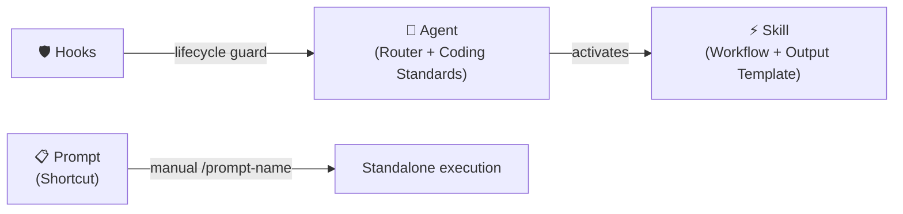
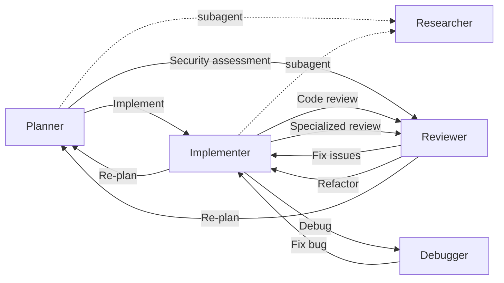

<div align="center">

# Copilot Agentic Context Engineering

**English** | [繁體中文](README.zh-TW.md)

[](LICENSE)
[](https://github.com/zexion7873/copilot-setting/stargazers)
[](https://github.com/zexion7873/copilot-setting/commits)
[](https://github.com/zexion7873/copilot-setting/issues)
[](https://github.com/zexion7873/copilot-setting)

</div>

Agentic context engineering for GitHub Copilot — agents route workflows and enforce conventions, skills define processes, hooks guard execution.

---

## 🚀 Quick Start

### Option A — Single Project

Copy the `.github/` directory into your project root:

```text
your-java-project/
├── .github/          ← paste here
├── src/
├── pom.xml
└── ...
```

Copilot picks it up automatically — agents, skills, hooks, all active.

### Option B — Workspace-Wide

Add this repository as a folder in a VS Code [multi-root workspace](https://code.visualstudio.com/docs/editor/multi-root-workspaces). Every project in the workspace shares the configuration.

```text
my-workspace.code-workspace
├── copilot-setting/      ← this repo
├── project-a/
├── project-b/
└── ...
```

---

## ⚙️ How It Works

Just pick an **agent** — everything else loads automatically.

| Category | Role | Responsibility | When it loads |
|---|---|---|---|
| **Agents** (`agents/`) | Router + Standards | Activate workflows, manage handoffs, enforce coding standards | `@agent-name` in chat |
| **Skills** (`skills/`) | Workflow | Execution steps — reference rules and templates | Matches `description`; Skill Activation routes |
| **Prompts** (`prompts/`) | Shortcut | Lightweight single-task commands | Manual invocation (`/prompt-name`) |
| **Hooks** (`hooks/`) | Lifecycle guard | Block dangerous commands before execution | Agent tool use events |

Resources reference each other to avoid duplication — each category has one job, content that belongs elsewhere is delegated, not copied.



> [!NOTE]
> **Coding standards in agents:** Code-touching agents (`@implementer`, `@reviewer`, `@debugger`) embed coding standards directly in their agent file for deterministic loading — no separate rule files needed.

> [!TIP]
> **Maintenance rule:** before renaming or moving any file under `.github/`, run `grep -rn "<old-filename>" .github/` to find inbound references. Broken paths silently degrade Copilot output.

---

## 🔄 Typical Workflow

Example: adding a new API endpoint.

```text
You  →  @planner       "I need an API to query order history by customer ID"
                        Planner scans the codebase, drafts a phased plan,
                        then writes a formal SDD (spec) with acceptance criteria
                        ↓ click "開始實作" handoff

You  →  @implementer   Picks up the SDD, writes code following existing patterns
                        ↓ click "Code Review" handoff

You  →  @reviewer      Checks correctness, security, performance
                        Catches SQL injection risk → CRITICAL
                        ↓ click "修復問題" handoff

You  →  @implementer   Switches to PreparedStatement, verifies fix
                        Done ✓
```

Each `↓` is a handoff button in VS Code. The next agent gets the full conversation context.

> [!TIP]
> **Other common starting points:**
>
> - Bug → `@debugger` → `@implementer`
> - Slow SQL → `@reviewer` (SQL review mode) → `@implementer`
> - Security → `@reviewer` (security audit mode) → `@implementer`
> - Spec review → `@reviewer` (SDD review mode) → `@planner`
> - Documentation → `@planner`

---

## 🤖 Agents

Invoke via `@agent-name` in Copilot Chat. All agents are tailored for Java 8 / Maven projects.

|   | Agent | Model | Description |
|:-:|-------|-------|-------------|
| 📐 | `@planner` | Claude Opus 4.6 | Activates `plan` / `tasks` / `clarify-task` skills; planning and task decomposition in one agent |
| 🔨 | `@implementer` | GPT-5.3-Codex | Activates `implement` / `refactor` / `test-design` / `performance` skills, mode-routed by trigger phrase |
| 🔍 | `@reviewer` | Claude Opus 4.6 | Activates `code-review` / `security-audit` / `sql-review` / `schema-migration-review` / `pom-review` skills, mode-routed by review type |
| 🐛 | `@debugger` | Claude Opus 4.6 | Activates `debug` skill — hypothesis ranking, binary-search isolation, minimal fix with regression test |
| 📚 | `@researcher` | Claude Haiku 4.5 | Lightweight read-only subagent for `@implementer` and `@planner` — searches codebase and external docs, returns structured summaries |

### 🤝 Agent Handoffs Workflow

Agents can hand off tasks to each other, forming a collaborative workflow:



---

## ⚡ Skills

Executable workflows. Auto-triggered by Copilot when relevant (unless disabled), or invoke manually via `/skill-name`.

|   | Skill | Trigger | Description |
|:-:|-------|---------|-------------|
| ❓ | `clarify-task` | Auto + Manual | Interactive task refinement — numbered clarifying questions before acting |
| 📐 | `plan` | Auto + Manual | Scope-adaptive implementation plan — Small/Medium/Large; Large scope includes API contract, data model, error handling |
| ☑️ | `tasks` | Auto + Manual | Dependency-ordered atomic task breakdown (T### IDs, [P] markers) after plan is approved |
| 🔨 | `implement` | Auto + Manual | Feature implementation with SDD compliance, pattern discovery, and self-verification |
| ♻️ | `refactor` | Auto + Manual | Surgical refactoring — extract, rename, eliminate smells |
| 🧪 | `test-design` | Auto + Manual | Test case document design — boundary identification, category classification, coverage gap audit (produces documentation, not test code) |
| 📦 | `git-commit` | **Manual only** | Conventional commit message generation and intelligent staging |
| 🔍 | `code-review` | Auto + Manual | Structured code review — correctness, style, bug patterns |
| 🛡️ | `security-audit` | Auto + Manual | OWASP Top 10 audit with severity classification |
| 🗄️ | `sql-review` | Auto + Manual | SQL review — injection prevention, index strategy, anti-patterns |
| 🔄 | `schema-migration-review` | Auto + Manual | DDL/DML migration review — rollback safety, lock impact, backward compatibility |
| 🧱 | `pom-review` | Auto + Manual | Maven `pom.xml` review — dependency hygiene, CVE check, scope and SNAPSHOT discipline |
| 🐛 | `debug` | Auto + Manual | Systematic debugging with hypothesis ranking and isolation |
| ⚡ | `performance` | Auto + Manual | Measure-first performance tuning across frontend, Java backend, and DB |

> [!WARNING]
> `git-commit` uses `disable-model-invocation: true` to prevent auto-triggering. Always invoke explicitly via `/git-commit`.

---

## 📋 Prompts

Lightweight shortcuts. Invoke via `/prompt-name` in Copilot Chat.

| Prompt | Description |
|--------|-------------|
| `/explain-this` | Explain selected code in Traditional Chinese — role, design decisions, gotchas |
| `/find-impact` | List all callers and dependents of the selected method/class |
| `/check-n-plus-1` | Check a service method for N+1 query problems |
| `/generate-migration-sql` | Generate MySQL migration + rollback scripts from hbm.xml changes |
| `/check-tx` | Verify transaction boundary correctness (self-invocation, rollback-for, read-only) |

---

## 📜 copilot-instructions.md

Minimal global rules loaded in every conversation. Language, tech stack, and coding philosophy — plus a **Hard Rules** section that provides cross-cutting floor rules applied by all agents regardless of which skill is active.

- Respond in Traditional Chinese (繁體中文)
- Tech stack: Java 8, Maven, Spring 3.2, Spring Security 3.2, Hibernate 4.2, MySQL 8.0, JSP + JSTL 1.2
- Coding philosophy: think before coding (surface assumptions, don't guess), simplicity first (no speculative abstractions), surgical changes (touch only what the task requires)
- Hard Rules: non-negotiable constraints (Java 8 only, no Spring Boot, no JPA, SQL injection zero tolerance, no terminal file writes) that every agent enforces unconditionally

---

<details>
<summary><h2>📁 .github/ Directory Structure</h2></summary>

```text
~/.github/
├── copilot-instructions.md                ← Global base rules
│
├── agents/                                ← Invoke via @agent-name in chat (includes Coding Standards)
│   ├── planner              (Claude Opus 4.6)
│   ├── implementer          (GPT-5.3-Codex)
│   ├── reviewer             (Claude Opus 4.6)
│   ├── debugger             (Claude Opus 4.6)
│   └── researcher           (Claude Haiku 4.5)
│
├── hooks/                                 ← Shell commands at agent lifecycle events
│   ├── default.json
│   └── scripts/
│       └── block-dangerous-commands.sh
│
├── prompts/                               ← Lightweight single-task shortcuts (/prompt-name)
│   ├── explain-this
│   ├── find-impact
│   ├── check-n-plus-1
│   ├── generate-migration-sql
│   └── check-tx
│
└── skills/                                ← Executable skills for agents (output templates embedded)
    ├── clarify-task/
    ├── plan/
    ├── tasks/
    ├── implement/
    ├── refactor/
    ├── test-design/
    ├── git-commit/
    ├── code-review/
    ├── security-audit/
    ├── sql-review/
    ├── debug/
    └── performance/
```

</details>
