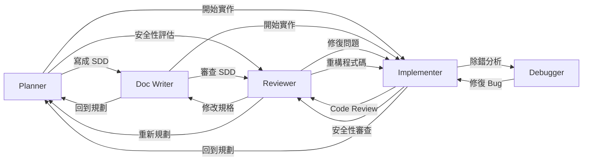
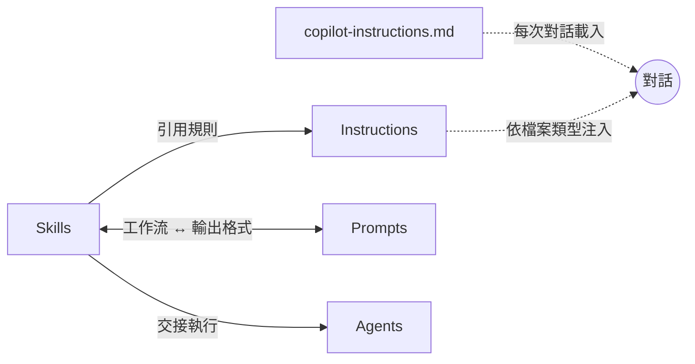
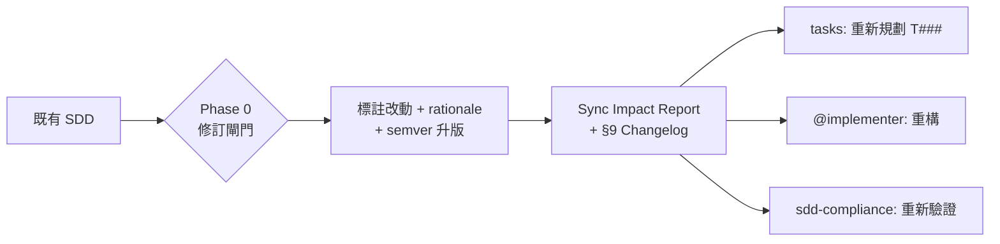

<div align="center">

# 全域 GitHub Copilot 設定

[English](README.md) | **繁體中文**

[](LICENSE)
[](https://github.com/zexion7873/copilot-setting/stargazers)
[](https://github.com/zexion7873/copilot-setting/commits)
[](https://github.com/zexion7873/copilot-setting/issues)
[](https://github.com/zexion7873/copilot-setting)


</div>

個人 Copilot 設定。部分檔案參考自 [awesome-copilot](https://github.com/github/awesome-copilot)，並依需求調整。

---

## 📁 目錄結構

```
~/.github/
├── copilot-instructions.md                ← 全域基礎指示（客製）
│
├── instructions/                          ← 依 applyTo 規則自動套用
│   ├── context7
│   ├── error-handling
│   ├── global-copilot
│   ├── javadoc
│   ├── jsp
│   ├── junit
│   ├── logging
│   ├── markdown
│   ├── no-heredoc
│   ├── security-and-owasp
│   ├── self-explanatory-code-commenting
│   ├── sql-rules
│   ├── sql-sp-generation
│   ├── xml
│   ├── properties
│   └── yaml-json-config
│
├── agents/                                ← 在聊天中以 @agent-name 呼叫
│   ├── planner              (Claude Opus 4.6)
│   ├── implementer          (GPT-5.3-Codex)
│   ├── reviewer             (Claude Opus 4.6)
│   ├── debugger             (Claude Opus 4.6)
│   └── doc-writer           (Claude Sonnet 4.6)
│
├── prompts/                               ← 標準/輸出格式參考，與 skill 配對使用
│   ├── adr-template
│   ├── code-review-checklist
│   ├── plan-template
│   ├── spec-template
│   ├── sql-review-output
│   └── tasks-template
│
└── skills/                                ← Agent 可執行的技能
    ├── adr/
    ├── clarify-task/
    ├── code-review/
    ├── constitution/
    ├── context-discovery/
    ├── debug/
    ├── git-commit/
    ├── implement/
    ├── performance/
    ├── plan/
    ├── refactor/
    ├── sdd/
    ├── sdd-compliance/
    ├── sdd-review/
    ├── security-audit/
    ├── spike/
    ├── sql-review/
    ├── tasks/
    └── test-design/
```

---

## 📜 copilot-instructions.md（客製）

每次對話都載入的全域最小規範。只定義語言和技術環境 — 其他慣例由專屬 instruction 各自負責。

- 以繁體中文回覆
- 程式碼中的註解、變數名稱、類別名稱一律使用英文
- 技術環境：Java 8、Maven、無 Spring Boot

> [!NOTE]
> **為什麼 `global-copilot.instructions.md` 內容一樣？**
>
> Copilot 透過兩個獨立的 scope 載入指示：
>
> | Scope | 載入機制 | 對應檔案 |
> |-------|----------|----------|
> | **Project** | Copilot 自動載入 `.github/copilot-instructions.md`（內建慣例） | `copilot-instructions.md` |
> | **User** | VS Code setting 指向 `~/.github/instructions/` 路徑 | `global-copilot.instructions.md` |
>
> Project scope 的載入機制無法引用 instructions 資料夾內的檔案，因此內容必須各放一份。這是 Copilot 平台的限制，並非意外重複。

---

## 📏 Instructions（指示）

當目前編輯的檔案符合 `applyTo` glob 時，自動注入 system prompt。

| 檔案 | applyTo | 說明 |
|------|---------|------|
| `context7` | `**` | 透過 Context7 MCP 取得權威的外部文件與 API 參考 |
| `error-handling` | `**/*.java` | 例外處理慣例 — 階層設計、自訂例外、重試策略、錯誤傳播 |
| `global-copilot` | `**` | 全域編碼標準、慣例與規範 |
| `logging` | `**/*.java` | SLF4J + Logback 慣例 — 嚴重度、參數化訊息、上下文、安全性 |
| `javadoc` | `**/*.java` | Javadoc 規範 — 必要標籤、摘要句、格式與反模式 |
| `jsp` | `**/*.jsp` | JSP 模板慣例 — 輸出編碼、JSTL 使用、避免 scriptlet、XSS 防護 |
| `junit` | `**/*Test.java, **/*IT.java, **/test/**/*.java` | JUnit 5 + Mockito 規範 — 命名、AAA、參數化測試、斷言 |
| `markdown` | `**/*.md` | 遵循 CommonMark 規範（0.31.2）的 Markdown 格式 |
| `no-heredoc` | `**` | 防止終端機 heredoc 導致檔案毀損，強制使用檔案編輯工具 |
| `security-and-owasp` | `**/*.{java,jsp}` | 基於 OWASP Top 10 的安全編碼 |
| `self-explanatory-code-commenting` | `**/*.{java,js,ts,py,cs}` | 撰寫自解釋程式碼，減少冗餘註解 |
| `sql-rules` | `**/*.{java,sql,xml,jsp}` | SQL 硬規則：injection 防護、效能、程式碼品質（單一來源） |
| `sql-sp-generation` | `**/*.sql` | MySQL 預存程序與 schema 慣例 |
| `xml` | `**/*.xml` | Maven POM、web.xml 及 XML 設定檔慣例 |
| `properties` | `**/*.properties` | Java properties 檔慣例 — 命名、組織、編碼、機敏資訊管理 |
| `yaml-json-config` | `**/*.yml, **/*.yaml, **/*.json` | YAML / JSON 設定檔慣例 — 格式、結構、機敏資訊管理 |

---

## 🤖 Agents（代理人）

在 Copilot Chat 中輸入 `@agent-name` 呼叫。所有 agent 皆針對 Java 8 / Maven 專案客製。

|   | Agent | Model | 說明 |
|:-:|-------|-------|------|
| 📐 | `@planner` | Claude Opus 4.6 | 觸發 `plan` / `tasks` / `spike` / `adr` / `clarify-task` skill，依意圖自動分流（規劃 → 拆任務 → 調研 → 決策 → 釐清） |
| 🔨 | `@implementer` | GPT-5.3-Codex | 觸發 `implement` / `refactor` / `test-design` / `context-discovery` / `performance` skill，依觸發詞分流 |
| 🔍 | `@reviewer` | Claude Opus 4.6 | 觸發 `code-review` / `security-audit` / `sql-review` / `sdd-review` / `sdd-compliance` skill，依審查類型分流 |
| 🐛 | `@debugger` | Claude Opus 4.6 | 觸發 `debug` skill — 假說排序、二分隔離、最小修正並補回歸測試 |
| 📝 | `@doc-writer` | Claude Sonnet 4.6 | 觸發 `sdd` / `constitution` skill 寫正式規格與專案原則；也寫 Javadoc、API 文件、遷移指南 |

### Agent Handoffs 工作流程

Agent 間可互相交接任務，形成協作工作流：



---

## 📋 Prompts（提示模板）

標準與輸出格式參考，與 skill 配對使用。在 Copilot Chat 中以 `/prompt-name` 手動呼叫，或讓配對的 skill 自動引用。

| Prompt | 配對 skill | 用途 |
|--------|------------|------|
| `code-review-checklist` | `code-review` | 嚴重度分類與各類別檢查項目 |
| `sql-review-output` | `sql-review` | sql-review skill 的輸出格式參考（嚴重度分類、EXPLAIN cheat sheet） |
| `spec-template` | `sdd` | SDD 文件骨架 — 從背景目標到 changelog 共 9 個章節 |
| `plan-template` | `plan` | 實作計畫骨架，含 `REQ-` / `CON-` / `PAT-` / `FILE-` 編號 |
| `tasks-template` | `tasks` | 依賴排序的 `tasks.md` 骨架，含 T### IDs 與 `[P]` 平行標記 |
| `adr-template` | `adr` | ADR 骨架，含 Status / Context / Decision / Consequences / Alternatives |

> [!NOTE]
> **命名慣例**（後綴依內容類型）：
> - `*-template` — 可填空的骨架，用於一次性產出文件（如 `spec-template`、`plan-template`）
> - `*-checklist` — 分類條列的檢查清單（如 `code-review-checklist`）
> - `*-output` — 由配對 skill 引用的輸出格式 / cheat-sheet 參考（如 `sql-review-output`）

---

## ⚡ Skills（技能）

可執行的工作流。Copilot 判斷相關時自動觸發（除非停用），也可手動以 `/skill-name` 呼叫。

|   | Skill | 觸發方式 | 說明 |
|:-:|-------|----------|------|
| 📜 | `constitution` | 自動 + 手動 | 專案層級的不可動原則與治理規則 — 穩定、高層級（200 行硬上限） |
| ❓ | `clarify-task` | 自動 + 手動 | 互動式任務釐清 — 動手前以編號問題確認範圍 |
| 🗺️ | `context-discovery` | 自動 + 手動 | 動手前的 context map — 待修改檔案、相依、測試、參考模式 |
| 📐 | `plan` | 自動 + 手動 | 實作計畫 — 階段、需求、檔案、風險（原子任務拆解交給 `tasks` skill） |
| 📌 | `adr` | 自動 + 手動 | 架構決策記錄 — 包含狀態、替代方案、後果分析 |
| 🔬 | `spike` | 自動 + 手動 | 限時技術探針文件，針對單一問題的研究 |
| 📄 | `sdd` | 自動 + 手動 | SDD（Spec-Driven Development）文件 — 實作前的正式規格定義（支援 semver 版本化的修訂流程） |
| 📋 | `sdd-review` | 自動 + 手動 | 實作前的 SDD 規格審查 — 完整度、可測試性、可行性、清晰度稽核 |
| ☑️ | `tasks` | 自動 + 手動 | 依賴排序的原子任務拆解（T### IDs、[P] 平行標記），需 plan 或 SDD 先存在 |
| 🔨 | `implement` | 自動 + 手動 | 功能實作 — 遵循 SDD 規格、探索既有 pattern、自我驗證 |
| ✅ | `sdd-compliance` | 自動 + 手動 | 實作後的規格對齊矩陣 — 驗證每個 AC 都有 task、測試與程式碼證據 |
| ♻️ | `refactor` | 自動 + 手動 | 漸進式重構 — 擷取、重命名、消除異味 |
| 🧪 | `test-design` | 自動 + 手動 | 測試案例設計 — 邊界識別、分類、覆蓋率缺口分析；交接 @implementer 實作 |
| 📦 | `git-commit` | **僅手動** | Conventional Commit 訊息產生與智慧檔案暫存 |
| 🔍 | `code-review` | 自動 + 手動 | 結構化程式碼審查 — 正確性、風格、bug 模式（AC 追蹤請用 `sdd-compliance`） |
| 🛡️ | `security-audit` | 自動 + 手動 | OWASP Top 10 審查與嚴重度分類 |
| 🗄️ | `sql-review` | 自動 + 手動 | SQL 審查 — 注入防護、索引策略、反模式偵測 |
| 🐛 | `debug` | 自動 + 手動 | 系統化除錯，假說排序與二分隔離 |
| ⚡ | `performance` | 自動 + 手動 | Measure-first 效能調校，涵蓋前端、Java 後端、資料庫 |

> [!WARNING]
> `git-commit` 標記為**僅手動**，因為它會修改 git history。Copilot 靠 description 文字抑制自動觸發；請一律以 `/git-commit` 顯式呼叫。

---

## ⚙️ 運作機制

你只管切 **agent**，其他的自己來。

| 資源 | 何時載入 | 你要做什麼 |
|------|----------|-----------|
| **copilot-instructions.md** | 每次對話 | 不用動 — 永遠在 |
| **Instructions**（`instructions/`） | 檔案符合 `applyTo` glob（如 `**/*.java`） | 不用動 — 看你開什麼檔就注入什麼 |
| **Agents**（`agents/`） | 在 Chat 打 `@agent-name` | 選 agent |
| **Skills**（`skills/`） | Copilot 把你說的話比對 skill 的 `description` | 不用動 — 聊到就觸發 |
| **Prompts**（`prompts/`） | agent/skill 內部讀取，或你打 `/prompt-name` | 幾乎不用 — agent 自己會引用 |

資源之間互相引用以避免重複。Skill 將規則委派給 Instruction、輸出格式委派給 Prompt、執行委派給 Agent。



> [!TIP]
> **維護規則：** 重新命名或搬移 `.github/` 下的檔案前，先執行 `grep -rn "<舊檔名>" .github/` 檢查引用。路徑斷裂會無聲地降低 Copilot 的輸出品質。

---

## 🔄 典型工作流程

例子：加一支新的 API endpoint。

```
你  →  @planner       「我需要一支依客戶 ID 查訂單歷史的 API」
                       Planner 掃 codebase，拆出分階段計畫
                       ↓ 點「寫成 SDD」

你  →  @doc-writer    把計畫寫成 SDD（Spec-Driven Development）文件
                       ↓ 點「開始實作」

你  →  @implementer   照 SDD 和既有 pattern 寫 code
                        ↓ 點「Code Review」

你  →  @reviewer      查正確性、安全性、效能
                        抓到 SQL injection → CRITICAL
                        ↓ 點「修復問題」

你  →  @implementer   改成 PreparedStatement，補寫測試
                        Done ✓
```

每個 `↓` 是 VS Code 裡的 handoff 按鈕，下一個 agent 拿到完整對話脈絡。

> [!TIP]
> **其他常見起手式：**
> - Bug → `@debugger` → `@implementer`
> - SQL 太慢 → `@reviewer`（SQL review mode）→ `@implementer`
> - 資安 → `@reviewer`（security audit mode）→ `@implementer`
> - 審查規格 → `@reviewer`（SDD review mode）→ `@doc-writer`
> - 技術調研 → `@planner`（spike mode）→ `@planner`（plan mode）
> - 寫文件 → `@planner` → `@doc-writer`

### SDD 修訂工作流

當既有 SDD 在實作過程中需要修訂（新增需求、API 契約變動、schema 調整），`sdd` skill 會進入 **Phase 0 — Amendment Gate**，而不是從頭重寫：



Semver 慣例：**MAJOR**（破壞性：移除 AC、API 契約變更、不相容 schema）、**MINOR**（新增 AC、新增 endpoint、相容 schema 變更）、**PATCH**（澄清、措辭微調）。完整流程見 `.github/skills/sdd/SKILL.md`。
