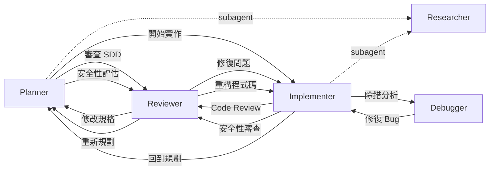

<div align="center">

# GitHub Copilot Configuration

[English](README.md) | **繁體中文**

[](LICENSE)
[](https://github.com/zexion7873/copilot-setting/stargazers)
[](https://github.com/zexion7873/copilot-setting/commits)
[](https://github.com/zexion7873/copilot-setting/issues)
[](https://github.com/zexion7873/copilot-setting)

</div>

多 agent 協作的 Copilot 設定——agent 啟動工作流、skill 定義流程（含輸出模板）、instruction 守規範。

---

## ⚙️ 運作機制

只需選擇 **agent**，其餘資源會自動載入。

| 類別 | 角色 | 職責邊界 | 何時載入 |
|---|---|---|---|
| **Instructions**（`instructions/`） | 規則 | 編碼規範單一來源 | 符合 `applyTo` glob；skill fallback 引用 |
| **Agents**（`agents/`） | 調度 | 啟動工作流、管理交接 | 在 Chat 打 `@agent-name` |
| **Skills**（`skills/`） | 工作流程 | 引用規則和模板的執行步驟 | 比對 `description`；Skill Activation 路由 |
| **Prompts**（`prompts/`） | 快捷指令 | 輕量單次任務指令 | 手動呼叫（`/prompt-name`） |
| **Hooks**（`hooks/`） | 生命週期守衛 | 攔截危險指令 | Agent 工具執行事件 |

資源之間互相引用以避免重複 — 每個類別只做一件事，需要別人的內容就引用、不要複製。

```text
Hooks ──生命週期守衛──→ Agent (調度)
                          │
                          └──啟動──→ Skill (工作流程 + 輸出模板)
                                          │
                                          └──規則──→ Instruction (規則)
```

> [!NOTE]
> **Agent chat 注意事項：** Instruction 只在編輯器 focus 到符合的檔案時才自動載入。在 `@agent` 對話中若沒有開啟對應檔案，檔案類型規則（如 `sql`、`spring-hibernate`）可能不會注入。為此，涉及程式碼的 skill（`implement`、`refactor`、`code-review`、`sql-review`、`security-audit`、`performance`、`debug`）內建了關鍵規則的 **fallback rules** — 不管開什麼檔案都會生效。

> [!TIP]
> **維護規則：** 重新命名或搬移 `.github/` 下的檔案前，先執行 `grep -rn "<舊檔名>" .github/` 檢查引用。路徑斷裂會無聲地降低 Copilot 的輸出品質。

---

## 🔄 典型工作流程

例子：加一支新的 API endpoint。

```text
你  →  @planner       「我需要一支依客戶 ID 查訂單歷史的 API」
                        Planner 掃 codebase，拆出分階段計畫，
                        接著寫正式 SDD（含驗收條件）
                        ↓ 點「開始實作」

你  →  @implementer   照 SDD 和既有 pattern 寫 code
                        ↓ 點「Code Review」

你  →  @reviewer      查正確性、安全性、效能
                        抓到 SQL injection → CRITICAL
                        ↓ 點「修復問題」

你  →  @implementer   改成 PreparedStatement，驗證修復
                        Done ✓
```

每個 `↓` 是 VS Code 裡的 handoff 按鈕，下一個 agent 拿到完整對話脈絡。

> [!TIP]
> **其他常見起手式：**
>
> - Bug → `@debugger` → `@implementer`
> - SQL 太慢 → `@reviewer`（SQL review mode）→ `@implementer`
> - 資安 → `@reviewer`（security audit mode）→ `@implementer`
> - 審查規格 → `@reviewer`（SDD review mode）→ `@planner`
> - 寫文件 → `@planner`

---

## 🤖 Agents

在 Copilot Chat 中輸入 `@agent-name` 呼叫。所有 agent 皆針對 Java 8 / Maven 專案客製。

|   | Agent | 模型 | 說明 |
|:-:|-------|------|------|
| 📐 | `@planner` | Claude Opus 4.6 | 觸發 `plan` / `tasks` / `sdd` / `clarify-task` skill；規劃、規格定義、任務拆解一站完成 |
| 🔨 | `@implementer` | GPT-5.3-Codex | 觸發 `implement` / `refactor` / `test-design` / `performance` skill，依觸發詞分流 |
| 🔍 | `@reviewer` | Claude Opus 4.6 | 觸發 `code-review` / `security-audit` / `sql-review` / `sdd-review` skill，依審查類型分流 |
| 🐛 | `@debugger` | Claude Opus 4.6 | 觸發 `debug` skill — 假說排序、二分隔離、最小修正並補回歸測試 |
| 📚 | `@researcher` | Claude Haiku 4.5 | 輕量唯讀 subagent，供 `@implementer` 和 `@planner` 派遣 — 搜 codebase 與外部文件，回傳結構化摘要 |

### 🤝 Agent Handoffs 工作流程

Agent 間可互相交接任務，形成協作工作流：



---

## ⚡ Skills

可執行的工作流。Copilot 判斷相關時自動觸發（除非停用），也可手動以 `/skill-name` 呼叫。

|   | Skill | 觸發方式 | 說明 |
|:-:|-------|----------|------|
| ❓ | `clarify-task` | 自動 + 手動 | 互動式任務釐清 — 動手前以編號問題確認範圍 |
| 📐 | `plan` | 自動 + 手動 | 實作計畫 — 階段、需求、檔案、風險（原子任務拆解交給 `tasks` skill） |
| 📄 | `sdd` | 自動 + 手動 | SDD（Spec-Driven Development）文件 — 實作前的正式規格定義 |
| 📋 | `sdd-review` | 自動 + 手動 | 實作前的 SDD 規格審查 — 完整度、可測試性、可行性、清晰度稽核 |
| ☑️ | `tasks` | 自動 + 手動 | 依賴排序的原子任務拆解（T### IDs、[P] 平行標記），需 plan 或 SDD 先存在 |
| 🔨 | `implement` | 自動 + 手動 | 功能實作 — 遵循 SDD 規格、探索既有 pattern、自我驗證 |
| ♻️ | `refactor` | 自動 + 手動 | 漸進式重構 — 擷取、重命名、消除異味 |
| 🧪 | `test-design` | 自動 + 手動 | 測試案例文件設計 — 邊界識別、分類、覆蓋率缺口分析（產出文件，非測試程式碼） |
| 📦 | `git-commit` | **僅手動** | Conventional Commit 訊息產生與智慧檔案暫存 |
| 🔍 | `code-review` | 自動 + 手動 | 結構化程式碼審查 — 正確性、風格、bug 模式 |
| 🛡️ | `security-audit` | 自動 + 手動 | OWASP Top 10 審查與嚴重度分類 |
| 🗄️ | `sql-review` | 自動 + 手動 | SQL 審查 — 注入防護、索引策略、反模式偵測 |
| 🐛 | `debug` | 自動 + 手動 | 系統化除錯，假說排序與二分隔離 |
| ⚡ | `performance` | 自動 + 手動 | Measure-first 效能調校，涵蓋前端、Java 後端、資料庫 |

> [!WARNING]
> `git-commit` 使用 `disable-model-invocation: true` 防止自動觸發，請一律以 `/git-commit` 顯式呼叫。

---

## 📋 Prompts

輕量快捷指令。在 Copilot Chat 中以 `/prompt-name` 呼叫。

| Prompt | 說明 |
|--------|------|
| `/explain-this` | 用繁中解釋選取的程式碼 — 角色、設計決策、注意事項 |
| `/find-impact` | 列出 method/class 的所有呼叫者和影響範圍 |
| `/check-n-plus-1` | 檢查 service method 有沒有 N+1 query 問題 |
| `/migration-sql` | 從 hbm.xml 變更產生 MySQL migration + rollback script |
| `/check-tx` | 檢查 transaction 邊界正確性（self-invocation、rollback-for、read-only） |
| `/write-javadoc` | 為 class/method 產生 Javadoc |

---

## 📏 Instructions

當目前編輯的檔案符合 `applyTo` glob 時，自動注入 system prompt。

| 檔案 | applyTo | 說明 |
|------|---------|------|
| `java` | `**/*.java` | Java 8 語言邊界、例外處理、SLF4J logging、程式碼風格 — 聚焦在 AI 模型預設會搞錯的部分 |
| `spring-hibernate` | `**/*.java, **/*.hbm.xml` | Spring Core + Hibernate 4.x — native Session API、hbm.xml mapping、`getCurrentSession()` 生命週期、XML `<tx:advice>` transaction。**最關鍵的一份** |
| `sql` | `**/*.java, **/*.sql, **/*.xml` | SQL injection 防護、效能陷阱、JDBC resource handling、MySQL 預存程序慣例 |
| `security` | `**/*.java, **/*.jsp` | OWASP Top 10 精華版，針對 Java web 應用 |
| `jsp` | `**/*.jsp` | JSP 慣例 — 透過 `<c:out>` 防 XSS、JSTL-only 政策、輸出編碼 |
| `xml-config` | `**/*.xml` | Spring XML config、Hibernate hbm.xml、Maven POM 慣例 |
| `no-heredoc` | `**` | 防止終端機 heredoc 導致檔案毀損，強制使用檔案編輯工具 |

---

## 📜 copilot-instructions.md

每次對話都載入的全域最小規範。只定義語言和技術環境 — 其他慣例由專屬 instruction 各自負責。

- 以繁體中文回覆
- 技術環境：Java 8、Maven、Spring 3.2、Spring Security 3.2、Hibernate 4.2、MySQL 8.0、JSP + JSTL 1.2

---

<details>
<summary><h2>📁 .github/ 目錄結構</h2></summary>

```text
~/.github/
├── copilot-instructions.md                ← 全域基礎指示
│
├── instructions/                          ← 依 applyTo 規則自動套用
│   ├── java
│   ├── spring-hibernate
│   ├── sql
│   ├── security
│   ├── jsp
│   ├── xml-config
│   └── no-heredoc
│
├── agents/                                ← 在聊天中以 @agent-name 呼叫
│   ├── planner              (Claude Opus 4.6)
│   ├── implementer          (GPT-5.3-Codex)
│   ├── reviewer             (Claude Opus 4.6)
│   ├── debugger             (Claude Opus 4.6)
│   └── researcher           (Claude Haiku 4.5)
│
├── hooks/                                 ← Agent 生命週期事件的 shell 命令
│   ├── default.json
│   └── scripts/
│       └── block-dangerous-commands.sh
│
├── prompts/                               ← 輕量快捷指令（/prompt-name）
│   ├── explain-this
│   ├── find-impact
│   ├── check-n-plus-1
│   ├── migration-sql
│   ├── check-tx
│   └── write-javadoc
│
└── skills/                                ← Agent 可執行的技能（輸出模板內嵌）
    ├── clarify-task/
    ├── plan/
    ├── sdd/
    ├── sdd-review/
    ├── tasks/
    ├── implement/
    ├── refactor/
    ├── test-design/
    ├── git-commit/
    ├── code-review/
    ├── security-audit/
    ├── sql-review/
    ├── debug/
    └── performance/
```

</details>
