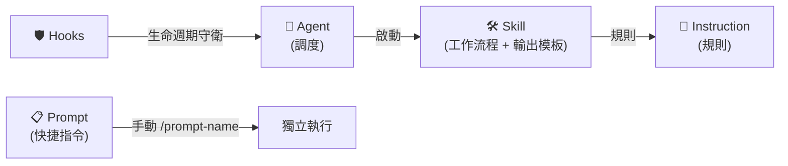
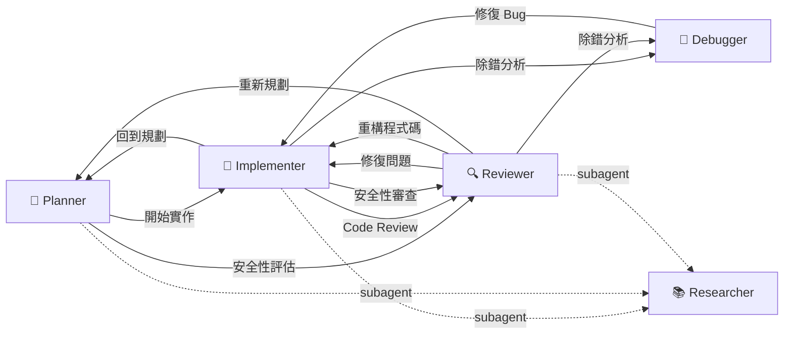

<div align="center">

# Copilot Agentic Context Engineering

[English](README.md) | **繁體中文**

[](LICENSE)
[](https://github.com/zexion7873/copilot-setting/stargazers)
[](https://github.com/zexion7873/copilot-setting/commits)
[](https://github.com/zexion7873/copilot-setting/issues)
[](https://github.com/zexion7873/copilot-setting)

</div>

GitHub Copilot 的 agentic context engineering——agent 路由、skill 執行、instruction 守規範、hook 守安全。

---

## 🚀 Quick Start

### Option A — Single Project

將 `.github/` 目錄複製到你的專案根目錄：

```text
your-java-project/
├── .github/          ← 放這裡
├── src/
├── pom.xml
└── ...
```

Copilot 會自動載入 — agent、skill、instruction、hook 全部就位。

### Option B — Workspace-Wide

將本 repository 作為資料夾加入 VS Code [multi-root workspace](https://code.visualstudio.com/docs/editor/multi-root-workspaces)，workspace 內所有專案共享設定。

```text
my-workspace.code-workspace
├── copilot-setting/      ← 本 repo
├── project-a/
├── project-b/
└── ...
```

---

## ⚙️ How It Works

只需選擇 **agent**，其餘資源會自動載入。

|   | 類別 | 角色 | 職責邊界 | 何時載入 |
|:-:|---|---|---|---|
| 🤖 | **Agents**（`agents/`） | 調度 | 啟動工作流、管理交接 | 從 Chat 的 agents dropdown 選擇 |
| 🛠️ | **Skills**（`skills/`） | 工作流程 | 引用規則和模板的執行步驟 | 比對 `description`；Skill Activation 路由 |
| 📏 | **Instructions**（`instructions/`） | 規則 | 編碼規範單一來源 | request context 內有符合 `applyTo` glob 的檔案；核心規則另內嵌於程式碼相關 agent |
| 📋 | **Prompts**（`prompts/`） | 快捷指令 | 輕量單次任務指令 | 手動呼叫（`/prompt-name`） |
| 🛡️ | **Hooks**（`hooks/`） | 生命週期守衛 | 攔截危險指令 | Agent 工具執行事件 |

每個類別只做一件事。需要別人的內容就引用，不複製。



> [!IMPORTANT]
> **Agent chat 注意事項：** `applyTo` instruction 只在符合的檔案於 request 當下進入 context 時才載入（透過 `#file:` 或編輯器附加），且是 request 送出當下的靜態評估——agent 執行過程中才讀到的檔案不會回溯觸發。為了涵蓋 `@agent` 沒有附檔的情況，硬邊界規則直接內嵌在涉及程式碼的 agent 的 `## Coding Standards` 區段；涉及程式碼的 skill 另外列出對應的 instruction 檔。

> [!TIP]
> **維護規則：** 重新命名或搬移 `.github/` 下的檔案前，先執行 `grep -rn "<舊檔名>" .github/` 檢查引用。路徑斷裂會無聲地降低 Copilot 的輸出品質。

---

## 🤖 Agents

在 Copilot Chat 的 agents dropdown 選擇。所有 agent 皆針對 Java 8 / Maven 專案客製。

|   | Agent | 模型 | 說明 |
|:-:|-------|------|------|
| 📐 | `@planner` | Claude Opus 4.8 | 觸發 `plan` / `tasks` skill；需求釐清、規劃、任務拆解一站完成 |
| 🔨 | `@implementer` | GPT-5.3-Codex | 觸發 `implement` / `refactor` skill，依觸發詞分流 |
| 🔍 | `@reviewer` | Claude Opus 4.8 | 觸發 `code-review` / `security-audit` / `sql-review` / `verify` skill，依審查類型分流 |
| 🐛 | `@debugger` | Claude Sonnet 4.6 | 觸發 `debug` skill — 假說排序、二分隔離、最小修正方案 |
| 📚 | `@researcher` | GPT-5.4 mini | 輕量唯讀 subagent，供 `@planner`、`@implementer` 和 `@reviewer` 派遣 — 搜 codebase 與外部文件，回傳結構化摘要，不提供建議與決策 |

### 🤝 Agent Handoffs Workflow

Agent 間可互相交接任務，形成協作工作流：



---

## 🔄 Typical Workflow

每個 `→` 是 VS Code 裡的 handoff 按鈕——點下去，下一個 agent 拿到完整對話脈絡。每條路徑都以 `/git-commit` 收尾（手動呼叫，不會自動觸發）。

> [!NOTE]
> **閉環**（close-the-loop）：`plan` 定下驗收標準（AC-NNN）→ `@implementer` 實作 → `verify` 用可跑的檢查逐條把關 → 紅燈退回 `@implementer`，全綠才收 loop。exit condition 是這份驗證標準，不是 agent 自己的判斷。

**產出文件** — 產文件的 skill 全部寫進 `docs/plans/<feature>/`（一個功能一個資料夾）：

| Skill | 產出 |
|---|---|
| `plan` | `plan.md` — 分階段計畫，含驗收標準（AC-NNN） |
| `tasks` | `tasks.md` — 有依賴順序的原子任務（T###） |
| `verify` | `verification.md` — 每條標準綁一個可跑檢查 + pass/fail 閘門 |

`code-review` / `security-audit` / `sql-review` / `debug` 只出聊天 findings，不落檔。

### 📐 `@planner` — 新功能從這裡開始

| Skill | 做什麼 | 接著交給 |
|---|---|---|
| `plan` | 先釐清模糊需求，再建立分階段實作計畫，含風險與依賴 | 留在 `@planner` |
| `tasks` | 將核准的計畫拆成有依賴順序的原子任務 | → `@implementer` |

> [!TIP]
> 小改動（1–3 檔）跳過 `@planner`，直接找 `@implementer`。

### 🔨 `@implementer` — 寫 code、改 code

| Skill | 做什麼 | 接著交給 |
|---|---|---|
| `implement` | 實作功能任務或修復審查發現 | → `@reviewer`（verify 閘 → review） |
| `refactor` | 行為不變的結構改善 | → `@reviewer` |

### 🔍 `@reviewer` — 審查與稽核

| Skill | 何時使用 | 接著交給 |
|---|---|---|
| `code-review` | 一般程式碼審查 — 正確性、風格、bug | → `@implementer`（修復） |
| `security-audit` | OWASP Top 10 資安稽核 | → `@implementer`（修復） |
| `sql-review` | SQL 注入、索引策略、查詢反模式、migration rollback 安全性與鎖定影響 | → `@implementer`（修復） |
| `verify` | 從驗收標準推導檢查、綁定可跑指令、執行、判定 pass/fail | → `@implementer`（修復） |


> [!WARNING]
> 每個 finding 分級 CRITICAL / HIGH / MEDIUM / LOW；有未解的 CRITICAL/HIGH 不放行。
> 審查發現更深層 bug → `@debugger`。需要設計層級重做 → `@planner`。

### 🐛 `@debugger` — 診斷 bug

| Skill | 做什麼 | 接著交給 |
|---|---|---|
| `debug` | 重現 → 假說 → 隔離 → 驗證根因 → 提出最小修復 | → `@implementer`（修復） |

> [!NOTE]
> `@debugger` 只診斷，不實作修復。一律交給 `@implementer`。

### 📚 `@researcher` — 唯讀子代理（自動）

通常由 `@planner`、`@implementer`、`@reviewer` 自動派遣去掃 codebase 和外部文件，也可直接從 agents dropdown 選擇。回傳結構化摘要 — 不提供建議與決策。

---

## 🛠️ Skills

可執行的工作流。Copilot 判斷相關時自動觸發（除非停用），也可手動以 `/skill-name` 呼叫。

|   | Skill | 觸發方式 | 說明 |
|:-:|-------|----------|------|
| 🔍 | `code-review` | 自動 + 手動 | 結構化程式碼審查 — 正確性、風格、bug 模式 |
| 🐛 | `debug` | 自動 + 手動 | 系統化除錯，假說排序與二分隔離 |
| 🔨 | `implement` | 自動 + 手動 | 功能實作 — 探索既有 pattern、遵循規範、自我驗證 |
| 📐 | `plan` | 自動 + 手動 | 實作計畫 — 先釐清模糊需求，再產出階段、需求、驗收標準、檔案、風險（原子任務拆解交給 `tasks` skill） |
| ♻️ | `refactor` | 自動 + 手動 | 只動該動的重構 — 擷取、重命名、消除異味 |
| 🛡️ | `security-audit` | 自動 + 手動 | OWASP Top 10 審查與嚴重度分類 |
| 🔎 | `sql-review` | 自動 + 手動 | SQL 審查 — 注入防護、索引策略、反模式偵測、DDL/DML migration 安全性 |
| ☑️ | `tasks` | 自動 + 手動 | 依賴排序的原子任務拆解（T### IDs、[P] 平行標記），需 plan 先存在 |
| ✅ | `verify` | 自動 + 手動 | 閉環驗證 — 從驗收標準推導檢查、綁定可跑指令、執行、判定 pass/fail |

---

## 📋 Prompts

輕量快捷指令。在 Copilot Chat 中以 `/prompt-name` 呼叫。

| Prompt | 說明 |
|--------|------|
| `/check-n-plus-1` | 檢查 service method 有沒有 N+1 query 問題 |
| `/check-tx` | 檢查 transaction 邊界正確性（self-invocation、rollback-for、read-only） |
| `/find-impact` | 列出 method/class 的所有呼叫者和影響範圍 |
| `/generate-migration-sql` | 從 hbm.xml 變更產生 MySQL migration + rollback script |
| `/git-commit` | 暫存相關變更並以 [Conventional Commits](https://www.conventionalcommits.org/) 格式提交 |

---

## 📏 Instructions

當目前編輯的檔案符合 `applyTo` glob 時，自動注入 system prompt。

| 檔案 | applyTo | 說明 |
|------|---------|------|
| `java` | `**/*.java` | Java 8 語言邊界、例外處理、SLF4J logging、程式碼風格 — 聚焦在 AI 模型預設會搞錯的部分 |
| `jsp` | `**/*.jsp` | JSP 慣例 — 透過 `<c:out>` 防 XSS、JSTL-only 政策、輸出編碼 |
| `security` | `**/*.java, **/*.jsp` | OWASP Top 10 精華版，針對 Java web 應用 |
| `spring-hibernate` | `**/*.java, **/*.hbm.xml` | Spring Core 3.2 + Hibernate 4.2 — native Session API、hbm.xml mapping、`getCurrentSession()` 生命週期、XML `<tx:advice>` transaction。**最關鍵的一份** |
| `sql` | `**/*.java, **/*.hbm.xml` | SQL injection 防護、效能陷阱、JDBC resource handling |
| `sql-ddl` | `**/*.sql` | MySQL DDL 與 migration 安全 — rollback script、online schema change、預存程序 |
| `testing` | `**/*Test.java, **/*Tests.java, **/*IT.java` | 測試慣例 — JUnit 4 + Mockito + Spring Test 3.2，禁 JUnit 5 / Spring Boot Test |
| `xml-config` | `**/*.xml` | Spring XML config、Hibernate hbm.xml、Maven POM 慣例 |

---

## 📜 copilot-instructions.md

每次對話都載入的全域最小規範。語言、技術環境和編碼哲學 — 其他慣例由專屬 instruction 各自負責。

- 以繁體中文回覆
- 技術環境：Java 8、Maven、Spring 3.2、Spring Security 3.2、Hibernate 4.2、MySQL 8.0、SLF4J 1.7 + Logback、JSP + JSTL 1.2
- 編碼哲學：think before coding（先釐清假設、不要猜）、simplicity first（不做預測性抽象）、surgical changes（只動該動的）

---

<details>
<summary><h2>📁 What Copilot Loads</h2></summary>

```text
.github/
├── agents/                                ← 從 Chat 的 agents dropdown 選擇
│   ├── debugger.agent.md             (Claude Sonnet 4.6)
│   ├── implementer.agent.md          (GPT-5.3-Codex)
│   ├── planner.agent.md              (Claude Opus 4.8)
│   ├── researcher.agent.md           (GPT-5.4 mini)
│   └── reviewer.agent.md             (Claude Opus 4.8)
│
├── hooks/                                 ← Agent 生命週期事件的 shell 命令
│   ├── scripts/
│   │   └── block-dangerous-commands.sh
│   └── default.json
│
├── instructions/                          ← 依 applyTo 規則自動套用
│   ├── java.instructions.md
│   ├── jsp.instructions.md
│   ├── security.instructions.md
│   ├── spring-hibernate.instructions.md
│   ├── sql-ddl.instructions.md
│   ├── sql.instructions.md
│   ├── testing.instructions.md
│   └── xml-config.instructions.md
│
├── prompts/                               ← 輕量快捷指令（/prompt-name）
│   ├── check-n-plus-1.prompt.md
│   ├── check-tx.prompt.md
│   ├── find-impact.prompt.md
│   ├── generate-migration-sql.prompt.md
│   └── git-commit.prompt.md
│
├── skills/                                ← Agent 可執行的技能（輸出模板內嵌）
│   ├── code-review/
│   ├── debug/
│   ├── implement/
│   ├── plan/
│   ├── refactor/
│   ├── security-audit/
│   ├── sql-review/
│   ├── tasks/
│   └── verify/
│
└── copilot-instructions.md                ← 全域基礎指示
```

</details>
