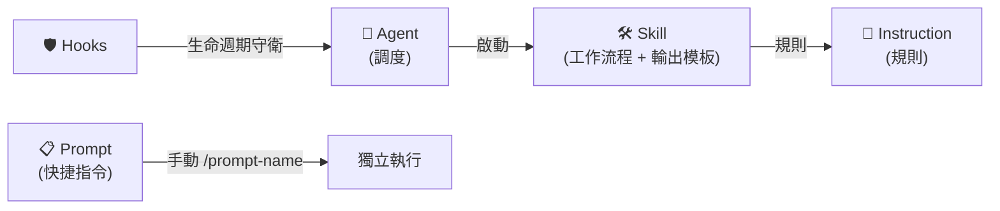
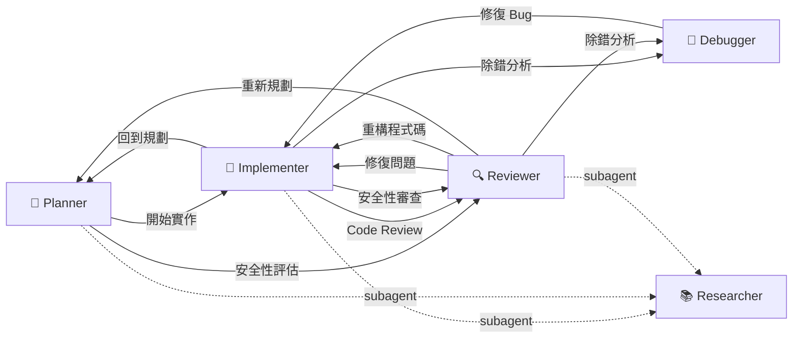

<div align="center">

# Copilot Agentic Context Engineering

[English](README.md) | **繁體中文**

[](LICENSE)
[](https://github.com/zexion7873/copilot-setting/stargazers)
[](https://github.com/zexion7873/copilot-setting/commits)
[](https://github.com/zexion7873/copilot-setting/issues)
[](https://github.com/zexion7873/copilot-setting)

</div>

GitHub Copilot 的 agentic context engineering——agent 路由、skill 執行、instruction 守規範、hook 守安全。

---

## 🚀 Quick Start

### Option A — Single Project

將 `.github/` 目錄複製到你的專案根目錄：

```text
your-java-project/
├── .github/          ← 放這裡
├── src/
├── pom.xml
└── ...
```

Copilot 會自動載入 — agent、skill、instruction、hook 全部就位。

### Option B — Workspace-Wide

將本 repository 作為資料夾加入 VS Code [multi-root workspace](https://code.visualstudio.com/docs/editor/multi-root-workspaces)，workspace 內所有專案共享設定。

```text
my-workspace.code-workspace
├── copilot-setting/      ← 本 repo
├── project-a/
├── project-b/
└── ...
```

---

## ⚙️ How It Works

只需選擇 **agent**，其餘資源會自動載入。

|   | 類別 | 角色 | 職責邊界 | 何時載入 |
|:-:|---|---|---|---|
| 📏 | **Instructions**（`instructions/`） | 規則 | 編碼規範單一來源 | request context 內有符合 `applyTo` glob 的檔案；核心規則另內嵌於程式碼相關 agent |
| 🤖 | **Agents**（`agents/`） | 調度 | 啟動工作流、管理交接 | 在 Chat 打 `@agent-name` |
| 🛠️ | **Skills**（`skills/`） | 工作流程 | 引用規則和模板的執行步驟 | 比對 `description`；Skill Activation 路由 |
| 📋 | **Prompts**（`prompts/`） | 快捷指令 | 輕量單次任務指令 | 手動呼叫（`/prompt-name`） |
| 🛡️ | **Hooks**（`hooks/`） | 生命週期守衛 | 攔截危險指令 | Agent 工具執行事件 |

每個類別只做一件事。需要別人的內容就引用，不複製。



> [!IMPORTANT]
> **Agent chat 注意事項：** `applyTo` instruction 只在符合的檔案於 request 當下進入 context 時才載入（透過 `#file:` 或編輯器附加），且是 request 送出當下的靜態評估——agent 執行過程中才讀到的檔案不會回溯觸發。為了涵蓋 `@agent` 沒有附檔的情況，硬邊界規則直接內嵌在涉及程式碼的 agent 的 `## Coding Standards` 區段；涉及程式碼的 skill 另外列出對應的 instruction 檔。

> [!TIP]
> **維護規則：** 重新命名或搬移 `.github/` 下的檔案前，先執行 `grep -rn "<舊檔名>" .github/` 檢查引用。路徑斷裂會無聲地降低 Copilot 的輸出品質。

---

## 🤖 Agents

在 Copilot Chat 中輸入 `@agent-name` 呼叫。所有 agent 皆針對 Java 8 / Maven 專案客製。

|   | Agent | 模型 | 說明 |
|:-:|-------|------|------|
| 📐 | `@planner` | Claude Sonnet 4.6 | 觸發 `plan` / `tasks` / `clarify-task` skill；規劃、任務拆解一站完成 |
| 🔨 | `@implementer` | GPT-5.3-Codex | 觸發 `implement` / `refactor` / `test-design` / `performance` skill，依觸發詞分流 |
| 🔍 | `@reviewer` | Claude Opus 4.8 | 觸發 `code-review` / `security-audit` / `sql-review` / `schema-migration-review` skill，依審查類型分流 |
| 🐛 | `@debugger` | Claude Sonnet 4.6 | 觸發 `debug` skill — 假說排序、二分隔離、最小修正方案 |
| 📚 | `@researcher` | GPT-5 mini | 輕量唯讀 subagent，供 `@planner`、`@implementer` 和 `@reviewer` 派遣 — 搜 codebase 與外部文件，回傳結構化摘要，不提供建議與決策 |

### 🤝 Agent Handoffs Workflow

Agent 間可互相交接任務，形成協作工作流：



---

## 🔄 Typical Workflow

每個 `→` 是 VS Code 裡的 handoff 按鈕——點下去，下一個 agent 拿到完整對話脈絡。每條路徑都以 `/git-commit` 收尾（手動呼叫，不會自動觸發）。

### 📐 `@planner` — 新功能從這裡開始

| Skill | 做什麼 | 接著交給 |
|---|---|---|
| `clarify-task` | 提出編號問題釐清模糊需求 | 留在 `@planner` |
| `plan` | 建立分階段實作計畫，含風險與依賴 | 留在 `@planner` |
| `tasks` | 將核准的計畫拆成有依賴順序的原子任務 | → `@implementer` |

> [!TIP]
> 小改動（1–3 檔）跳過 `@planner`，直接找 `@implementer`。

### 🔨 `@implementer` — 寫 code、改 code

| Skill | 做什麼 | 接著交給 |
|---|---|---|
| `implement` | 實作功能任務或修復審查發現 | → `@reviewer` |
| `refactor` | 行為不變的結構改善 | → `@reviewer` |
| `test-design` | 設計測試案例文件（分類、邊界、覆蓋缺口） | → `@reviewer` |
| `performance` | 先量測再優化（前端 / Java / DB） | → `@reviewer` |

### 🔍 `@reviewer` — 審查與稽核

| Skill | 何時使用 | 接著交給 |
|---|---|---|
| `code-review` | 一般程式碼審查 — 正確性、風格、bug | → `@implementer`（修復） |
| `security-audit` | OWASP Top 10 資安稽核 | → `@implementer`（修復） |
| `sql-review` | SQL 注入、索引策略、查詢反模式 | → `@implementer`（修復） |
| `schema-migration-review` | DDL/DML rollback 安全性、鎖定影響、部署相容 | → `@implementer`（修復） |


> [!WARNING]
> 每個 finding 分級 CRITICAL / HIGH / MEDIUM / LOW；有未解的 CRITICAL/HIGH 不放行。
> 審查發現更深層 bug → `@debugger`。需要設計層級重做 → `@planner`。

### 🐛 `@debugger` — 診斷 bug

| Skill | 做什麼 | 接著交給 |
|---|---|---|
| `debug` | 重現 → 假說 → 隔離 → 驗證根因 → 提出最小修復 | → `@implementer`（修復） |

> [!NOTE]
> `@debugger` 只診斷，不實作修復。一律交給 `@implementer`。

### 📚 `@researcher` — 唯讀子代理（自動）

不需手動呼叫。由 `@planner`、`@implementer`、`@reviewer` 自動派遣去掃 codebase 和外部文件。回傳結構化摘要 — 不提供建議與決策。

---

## 🛠️ Skills

可執行的工作流。Copilot 判斷相關時自動觸發（除非停用），也可手動以 `/skill-name` 呼叫。

|   | Skill | 觸發方式 | 說明 |
|:-:|-------|----------|------|
| 💬 | `clarify-task` | 自動 + 手動 | 互動式任務釐清 — 動手前以編號問題確認範圍 |
| 📐 | `plan` | 自動 + 手動 | 實作計畫 — 階段、需求、檔案、風險（原子任務拆解交給 `tasks` skill） |
| ☑️ | `tasks` | 自動 + 手動 | 依賴排序的原子任務拆解（T### IDs、[P] 平行標記），需 plan 先存在 |
| 🔨 | `implement` | 自動 + 手動 | 功能實作 — 探索既有 pattern、遵循規範、自我驗證 |
| ♻️ | `refactor` | 自動 + 手動 | 只動該動的重構 — 擷取、重命名、消除異味 |
| 🧪 | `test-design` | 自動 + 手動 | 測試案例文件設計 — 邊界識別、分類、覆蓋率缺口分析（產出文件，非測試程式碼） |
| 📦 | `git-commit` | **僅手動** | [Conventional Commits](https://www.conventionalcommits.org/) 訊息產生與智慧檔案暫存 |
| 🔍 | `code-review` | 自動 + 手動 | 結構化程式碼審查 — 正確性、風格、bug 模式 |
| 🛡️ | `security-audit` | 自動 + 手動 | OWASP Top 10 審查與嚴重度分類 |
| 🔎 | `sql-review` | 自動 + 手動 | SQL 審查 — 注入防護、索引策略、反模式偵測 |
| 🔀 | `schema-migration-review` | 自動 + 手動 | DDL/DML migration 審查 — rollback 安全性、鎖定衝擊、向後相容性 |
| 🐛 | `debug` | 自動 + 手動 | 系統化除錯，假說排序與二分隔離 |
| 🚀 | `performance` | 自動 + 手動 | Measure-first 效能調校，涵蓋前端、Java 後端、資料庫 |

> [!WARNING]
> `git-commit` 使用 `disable-model-invocation: true` 防止自動觸發，請一律以 `/git-commit` 顯式呼叫。

---

## 📋 Prompts

輕量快捷指令。在 Copilot Chat 中以 `/prompt-name` 呼叫。

| Prompt | 說明 |
|--------|------|
| `/explain-this` | 用繁中解釋選取的程式碼 — 角色、設計決策、注意事項 |
| `/find-impact` | 列出 method/class 的所有呼叫者和影響範圍 |
| `/check-n-plus-1` | 檢查 service method 有沒有 N+1 query 問題 |
| `/generate-migration-sql` | 從 hbm.xml 變更產生 MySQL migration + rollback script |
| `/check-tx` | 檢查 transaction 邊界正確性（self-invocation、rollback-for、read-only） |

---

## 📏 Instructions

當目前編輯的檔案符合 `applyTo` glob 時，自動注入 system prompt。

| 檔案 | applyTo | 說明 |
|------|---------|------|
| `java` | `**/*.java` | Java 8 語言邊界、例外處理、SLF4J logging、程式碼風格 — 聚焦在 AI 模型預設會搞錯的部分 |
| `spring-hibernate` | `**/*.java, **/*.hbm.xml` | Spring Core 3.2 + Hibernate 4.2 — native Session API、hbm.xml mapping、`getCurrentSession()` 生命週期、XML `<tx:advice>` transaction。**最關鍵的一份** |
| `sql` | `**/*.java, **/*.sql, **/*.xml` | SQL injection 防護、效能陷阱、JDBC resource handling、MySQL 預存程序慣例 |
| `security` | `**/*.java, **/*.jsp` | OWASP Top 10 精華版，針對 Java web 應用 |
| `jsp` | `**/*.jsp` | JSP 慣例 — 透過 `<c:out>` 防 XSS、JSTL-only 政策、輸出編碼 |
| `xml-config` | `**/*.xml` | Spring XML config、Hibernate hbm.xml、Maven POM 慣例 |
| `testing` | `**/*Test.java, **/*Tests.java, **/*IT.java` | 測試慣例 — JUnit 4 + Mockito + Spring Test 3.2，禁 JUnit 5 / Spring Boot Test |
| `no-heredoc` | `**` | 防止終端機 heredoc 導致檔案毀損，強制使用檔案編輯工具 |

---

## 📜 copilot-instructions.md

每次對話都載入的全域最小規範。語言、技術環境和編碼哲學 — 其他慣例由專屬 instruction 各自負責。

- 以繁體中文回覆
- 技術環境：Java 8、Maven、Spring 3.2、Spring Security 3.2、Hibernate 4.2、MySQL 8.0、JSP + JSTL 1.2
- 編碼哲學：think before coding（先釐清假設、不要猜）、simplicity first（不做預測性抽象）、surgical changes（只動該動的）

---

<details>
<summary><h2>📁 What Copilot Loads</h2></summary>

```text
.github/
├── copilot-instructions.md                ← 全域基礎指示
│
├── instructions/                          ← 依 applyTo 規則自動套用
│   ├── java.instructions.md
│   ├── spring-hibernate.instructions.md
│   ├── sql.instructions.md
│   ├── security.instructions.md
│   ├── jsp.instructions.md
│   ├── xml-config.instructions.md
│   ├── testing.instructions.md
│   └── no-heredoc.instructions.md
│
├── agents/                                ← 在聊天中以 @agent-name 呼叫
│   ├── planner.agent.md              (Claude Sonnet 4.6)
│   ├── implementer.agent.md          (GPT-5.3-Codex)
│   ├── reviewer.agent.md             (Claude Opus 4.8)
│   ├── debugger.agent.md             (Claude Sonnet 4.6)
│   └── researcher.agent.md           (GPT-5 mini)
│
├── hooks/                                 ← Agent 生命週期事件的 shell 命令
│   ├── default.json
│   └── scripts/
│       └── block-dangerous-commands.sh
│
├── prompts/                               ← 輕量快捷指令（/prompt-name）
│   ├── explain-this.prompt.md
│   ├── find-impact.prompt.md
│   ├── check-n-plus-1.prompt.md
│   ├── generate-migration-sql.prompt.md
│   └── check-tx.prompt.md
│
└── skills/                                ← Agent 可執行的技能（輸出模板內嵌）
    ├── clarify-task/
    ├── plan/
    ├── tasks/
    ├── implement/
    ├── refactor/
    ├── test-design/
    ├── git-commit/
    ├── code-review/
    ├── security-audit/
    ├── sql-review/
    ├── schema-migration-review/
    ├── debug/
    └── performance/
```

</details>
