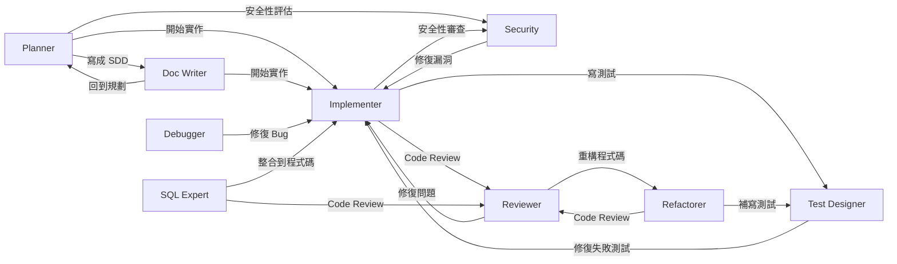

# 全域 GitHub Copilot 設定

[English](README.md) | **繁體中文**

[](LICENSE)
[](https://github.com/zexion7873/copilot-setting/stargazers)
[](https://github.com/zexion7873/copilot-setting/commits)
[](https://github.com/zexion7873/copilot-setting/issues)
[](https://github.com/zexion7873/copilot-setting)

個人 Copilot 設定。除 `copilot-instructions.md` 外，其餘檔案皆參考自 [awesome-copilot](https://github.com/github/awesome-copilot)，並依需求調整。

## 目錄結構

```
~/.github/
├── copilot-instructions.md                ← 全域基礎指示（客製）
│
├── instructions/                          ← 依 applyTo 規則自動套用
│   ├── context7
│   ├── context-engineering
│   ├── global-copilot
│   ├── markdown
│   ├── no-heredoc
│   ├── oop-design-patterns
│   ├── security-and-owasp
│   ├── self-explanatory-code-commenting
│   └── sql-sp-generation
│
├── agents/                                ← 在聊天中以 @agent-name 呼叫
│   ├── planner              (Claude Opus 4.6)
│   ├── implementer          (GPT-5.3-Codex)
│   ├── reviewer             (Claude Opus 4.6)
│   ├── test-designer        (Claude Sonnet 4.6)
│   ├── debugger             (Claude Opus 4.6)
│   ├── refactorer           (Claude Sonnet 4.6)
│   ├── sql-expert           (Claude Sonnet 4.6)
│   ├── doc-writer           (GPT-5 mini)
│   └── security             (Claude Opus 4.6)
│
├── prompts/                               ← 可重複使用的提示模板
│   ├── code-review-checklist
│   ├── context-map
│   ├── conventional-commit
│   ├── create-architectural-decision-record
│   ├── create-implementation-plan
│   ├── create-technical-spike
│   ├── first-ask
│   ├── java-docs
│   ├── java-junit
│   ├── java-refactoring-extract-method
│   ├── java-refactoring-remove-parameter
│   ├── performance-optimization
│   ├── refactor-plan
│   ├── review-and-refactor
│   ├── sql-code-review
│   ├── sql-optimization
│   └── what-context-needed
│
└── skills/                                ← Agent 可執行的技能
    ├── code-review/
    ├── debug/
    ├── git-commit/
    ├── implement/
    ├── refactor/
    ├── security-audit/
    ├── sql-review/
    └── test-design/
```

---

## copilot-instructions.md（客製）

每次對話都會自動載入的全域基礎指示。

- 以繁體中文回覆
- 程式碼中的註解、變數名稱、類別名稱一律使用英文
- 技術環境：Java 8、Maven、無 Spring Boot
- 包含程式碼風格、錯誤處理、Git 慣例、Logging 規範

---

## Instructions（指示）

當目前編輯的檔案符合 `applyTo` glob 時，自動注入 system prompt。

| 檔案 | applyTo | 說明 |
|------|---------|------|
| `context7` | `**` | 透過 Context7 MCP 取得權威的外部文件與 API 參考 |
| `context-engineering` | `**` | 優化程式碼與專案結構，讓 Copilot 更有效理解上下文 |
| `global-copilot` | `**` | 全域編碼標準、慣例與規範 |
| `markdown` | `**/*.md` | 遵循 CommonMark 規範（0.31.2）的 Markdown 格式 |
| `no-heredoc` | `**` | 防止終端機 heredoc 導致檔案毀損，強制使用檔案編輯工具 |
| `oop-design-patterns` | `**/*.{py,java,ts,js,cs}` | OOP 設計模式（GoF + SOLID） |
| `security-and-owasp` | `**/*.{java,jsp}` | 基於 OWASP Top 10 的安全編碼 |
| `self-explanatory-code-commenting` | `**/*.{java,js,ts,py,cs}` | 撰寫自解釋程式碼，減少冗餘註解 |
| `sql-sp-generation` | `**/*.sql` | MySQL SQL 語句與預存程序的產生規範 |

---

## Agents（代理人）

在 Copilot Chat 中輸入 `@agent-name` 呼叫。所有 agent 皆針對 Java 8 / Maven 專案客製。

| Agent | Model | 說明 |
|-------|-------|------|
| `@planner` | Claude Opus 4.6 | 分析需求、拆解任務、評估影響範圍 |
| `@implementer` | GPT-5.3-Codex | 撰寫符合規範的生產級 Java 程式碼 |
| `@reviewer` | Claude Opus 4.6 | 程式碼審查：正確性、安全性、效能、可維護性 |
| `@test-designer` | Claude Sonnet 4.6 | 設計完整測試案例（正常路徑、邊界、異常） |
| `@debugger` | Claude Opus 4.6 | 分析堆疊追蹤、追蹤執行流程來除錯 |
| `@refactorer` | Claude Sonnet 4.6 | 在不改變行為的前提下改善程式碼結構 |
| `@sql-expert` | Claude Sonnet 4.6 | SQL 撰寫、優化、審查與效能分析 |
| `@doc-writer` | GPT-5 mini | 撰寫 SDD、Javadoc、API 文件、遷移指南 |
| `@security` | Claude Opus 4.6 | 基於 OWASP Top 10 的 Java Web 安全審查 |

### Agent Handoffs 工作流程

Agent 間可互相交接任務，形成協作工作流：



---

## Prompts（提示模板）

可重複使用的提示模板，在 Copilot Chat 中以 `/prompt-name` 呼叫。

| Prompt | 說明 |
|--------|------|
| `context-map` | 修改前產生所有相關檔案的地圖 |
| `first-ask` | 互動式任務釐清 — 先確認範圍再行動 |
| `what-context-needed` | 回答問題前先讓 Copilot 列出需要查看的檔案 |
| `create-implementation-plan` | 為功能開發或重構建立結構化實作計畫 |
| `create-technical-spike` | 建立限時技術探針文件 |
| `create-architectural-decision-record` | 建立架構決策記錄（ADR）文件 |
| `java-docs` | 產生 Javadoc 註解 |
| `java-junit` | JUnit 5 單元測試含資料驅動測試 |
| `java-refactoring-extract-method` | 擷取方法（Extract Method）重構 |
| `java-refactoring-remove-parameter` | 移除參數（Remove Parameter）重構 |
| `sql-code-review` | SQL 審查（MySQL/PostgreSQL/SQL Server/Oracle） |
| `sql-optimization` | SQL 效能優化與執行計畫分析 |
| `review-and-refactor` | 依定義的規範審查並重構程式碼 |
| `refactor-plan` | 規劃多檔案重構的順序與回滾步驟 |
| `conventional-commit` | 產生 Conventional Commits 規範的提交訊息 |
| `performance-optimization` | 前端、後端、資料庫全方位效能最佳化 |
| `code-review-checklist` | 通用程式碼審查檢查清單 |

---

## Skills（技能）

可執行的工作流。Copilot 判斷相關時自動觸發（除非停用），也可手動以 `/skill-name` 呼叫。

| Skill | 觸發方式 | 說明 |
|-------|----------|------|
| `code-review` | 自動 + 手動 | 結構化程式碼審查，含問題分類與最終裁定 |
| `debug` | 自動 + 手動 | 系統化除錯，假說排序與二分隔離 |
| `git-commit` | **僅手動** | Conventional Commit 訊息產生與智慧檔案暫存 |
| `implement` | 自動 + 手動 | 功能實作 — 探索既有 pattern、開發、自我驗證 |
| `refactor` | 自動 + 手動 | 漸進式重構 — 擷取、重命名、消除異味 |
| `security-audit` | 自動 + 手動 | OWASP Top 10 審查與嚴重度分類 |
| `sql-review` | 自動 + 手動 | SQL 審查 — 注入防護、索引策略、反模式偵測 |
| `test-design` | 自動 + 手動 | 測試設計 — 邊界識別、JUnit 5 實作、覆蓋率分析 |

> `git-commit` 設定 `disable-model-invocation: true`，因為它會執行寫入操作（修改 git history）。
